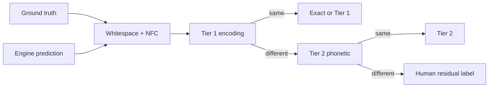

# BOOK.md

## Preface

This book is a teacher walking you through a research codebase.

It is not a changelog. `DECISIONS.md` and `IMPLEMENTATION.md` already
say what got built and why a particular library or threshold won. This
file answers a different question: **what problem exists in the world,
why is it hard, and what does building each piece of this repository
teach you about that problem?**

The test for every chapter is whether someone who has never opened this
repo — and does not already know computer vision or Indic scripts —
could read that chapter alone and come away understanding both the idea
and why this project needed it. After the Conclusion, a short
methodology section records what I would improve next — checkable
upgrades, not a second research program.

The chapters follow the order the work actually unfolded: first “how do
you even measure whether OCR got something right?”, then “how do you
control what a model sees?”, then “how do you open a model up and ask
whether it is reading or guessing?” Later chapters describe pieces that
are specified but not yet built in this phase; those are still taught
from first principles, so you know what they are *for* when you build
them.

A short orientation before Chapter 0:

- **Required work** in this repo is Stage 0 (error taxonomy), Stage 1
  (the controlled renderer), Stage 2a (the from-scratch instrument
  model), and the probe suite that opens that model.
- **Extensions** are the engineering that makes the science runnable on
  flaky Colab sessions: resume-by-default baselines, hand-review
  suggestions, line-crop export, `make smoke-test`.
- **Deferred research** (demo LoRA model, reading-order metrics, RLVR,
  Sarvam API transfer, triage cascade) is explained in later chapters
  so the design is not lost, but it is not claimed as finished.

Numbers that were actually recomputed from this checkout are labeled
**measured**. Numbers that appear in README or the site write-up but
whose result files are not in the tree are labeled **reported** — and
you should treat them that way until you re-run them.

> **What this book is for.** To rebuild the project with understanding,
> not to skim a list of claims.

---

## How to read this book

Start with Chapter 0 if computer vision is new to you. Otherwise start
with Chapter 1: that is where the project’s first surprising claim
lives.

Each chapter has the same shape:

1. A question that forced the chapter into existence.
2. The concept in plain language.
3. The design choice — what else was considered and why this won.
4. What got built, with real file paths.
5. What the evidence actually shows (or what is still missing).
6. One sentence to keep.

Appendices at the end are reference: decision IDs, built-vs-not,
reproduce commands. They are not the teaching path.

---

## Chapter 0 — What Is Computer Vision, and Why Is Reading Hard For a Machine

### Start with what a computer actually sees

A photograph, to you, is a scene: a page of a book, a signature, a road
sign. To a computer, it is a grid of numbers. A single-color pixel is
three numbers — how much red, how much green, how much blue, usually
each from 0 to 255. A modest photo, say 1000 pixels wide and 1000 tall,
is three million numbers. There is no “page” in there, no “letter,” no
“word.” Just a grid of brightness values.

Computer vision is the field concerned with one question: how do you get
from that grid of numbers to something that counts as understanding —
“this says Priya,” “this is a cat,” “this door is open”? Every technique
in this repo, from a ~20-million-parameter instrument model to a
production document system, is ultimately an answer to that one
question, just at different scales of ambition.

### Why “just teach it letters” doesn’t work

The oldest and most tempting approach to reading text from an image is:
find each letter, look up what it is, done. This is called
segmentation-then-classification, and for a long time it is roughly how
OCR worked. It fails for reasons that are genuinely instructive:

- **Letters touch each other.** In cursive handwriting, in many fonts,
  and structurally in scripts like Devanagari (where a connecting line
  called the *shirorekha* runs across the top of a whole word), there
  often isn’t a clean gap between one letter and the next to cut along.
- **One “letter” isn’t always one visual unit.** In Devanagari, a base
  consonant can combine with a vowel sign (a *matra*) that appears
  above, below, beside, or wrapped around it, and two or more
  consonants can stack into a single fused glyph called a *conjunct*
  (a *saṃyuktākṣara*). The visually atomic unit — the thing a reader’s
  eye treats as one character — is called a *grapheme cluster*, and it
  can correspond to two, three, or more separate values in the
  underlying digital text encoding. This mismatch between “one visual
  thing” and “one encoded thing” turns out to matter enormously for
  how you measure whether a system got the reading right — see
  Chapter 1.
- **Context changes what a shape means.** The same rough pixel pattern
  can be one letter in one font and a different letter in another; a
  smudge can look exactly like a diacritic. A system that classifies
  each cropped-out shape independently, with no knowledge of what came
  before or after it, throws away the single strongest signal a human
  reader actually uses: everything else on the page.

Modern systems, including the small one built in this repo, sidestep
segmentation almost entirely. Instead of “find each letter, then
classify it,” the approach is “look at the whole image, and generate the
text one unit at a time, using both the image and everything generated
so far as context.” That is a genuinely different kind of machine, and
it is worth understanding why it works.

### The two halves of a document-reading model

Every model in this repo, and production systems like it, has (at least)
two halves that do fundamentally different jobs.

**The encoder** looks at the image and turns it into a set of numeric
*features* — vectors that capture “what’s visually going on here,”
without yet committing to any specific letter or word. Modern encoders
for this job are usually Vision Transformers (ViTs): the image gets cut
into small square patches (say 14×14 pixels each), each patch becomes a
vector, and a mechanism called *self-attention* lets every patch’s
representation get updated based on every other patch. This is what
lets the model notice, for instance, that a mark above a letter and the
base letter below it belong together as one grapheme cluster, even
though they are in different patches.

**The decoder** takes those image features and generates text, one
grapheme cluster at a time. At each step it looks at the image features
and everything it has generated so far, and predicts what comes next.
This is the same basic mechanism that powers large language models, just
conditioned on an image instead of, or in addition to, prior text.

The connective tissue between these two halves — how image features get
translated into something the text decoder can use — is itself a design
decision with real consequences. In this project it is a simple linear
projection between two different hidden sizes (Chapter 3).

### Why this is a genuinely hard problem, not a solved one

English-language OCR on clean printed text is close to a solved problem
and has been for years. It is tempting to assume “OCR” in general is
solved and everything past that is refinement. This project exists
because that assumption is wrong for the majority of the world’s
scripts, and the reasons are specific rather than vague:

1. **Data.** The internet, and therefore the training data every large
   model learns from, is overwhelmingly English and a handful of other
   high-resource languages. A model can only get good at reading what
   it has seen enough of.
2. **Script structure.** Complex scripts genuinely require more visual
   reasoning per character than Latin text does — conjuncts, stacking
   diacritics, and connecting strokes are not just “different letters,”
   they are a different geometric problem.
3. **These two causes get tangled together in every published result.**
   When a benchmark shows a language scoring low, that low score could
   be because the model barely saw that language during training, or
   because that script is intrinsically harder to read, or some mix of
   both — and a benchmark table alone cannot tell you which. Published
   Indic OCR tables show large spreads across languages with no
   explanation of how much is which cause. (This project’s motivating
   numbers were re-checked against Sarvam’s own Vision blog in August
   2026; see `DECISIONS.md` #6.)

That untangling — how much of a language’s poor performance is “we
didn’t show the model enough of it” versus “this script is inherently
harder to read” — is not answerable by looking at outputs alone. It
requires being able to control what a model sees during training and
then measure what it learned. That requires *owning* the model, not
querying it through an API. That single sentence is the entire reason
this project builds a model from scratch rather than only ever calling
someone else’s.

### What’s coming

Every chapter after this one follows the same shape: a real problem in
computer vision, why it’s hard, and then what building a piece of this
repo taught about it. Chapter 1 starts with something that sounds
boring — how do you even *measure* whether OCR got something right? —
and shows why that question turns out to be far less obvious than it
looks, especially for scripts where “one character” and “one encoded
value” aren’t the same thing.

> **What to remember.** A machine does not see letters; it sees numbers.
> Reading systems generate text from images one visual unit at a time,
> and for Indic scripts the hardest scientific question is often not
> “how do I get a higher score,” but “what does that score even mean?”

---

## Chapter 1 — Measuring Correctness Is Its Own Hard Problem

### The question that forced this chapter

Suppose two OCR engines disagree with the ground-truth string. Are they
both wrong? Or did one of them write the *same reading* using a
different, equally valid Unicode spelling?

If you cannot answer that, every published “error rate” for Indic OCR
is partly fiction. Stage 0 of this project exists to force that answer
into the open *before* anyone trains a new model.

### What “correct” even means

Character error rate (CER) is the usual OCR metric: how many edits
(insertions, deletions, substitutions) does it take to turn the
prediction into the reference? That metric quietly assumes the
reference has one canonical digital form.

Indic orthography violates that assumption constantly. The same spoken
word, and often the same visual page, can be encoded several ways:

- Sentence-final punctuation as Devanagari danda `।`, Latin period `.`,
  or even a plain ASCII pipe `|` that some engines emit when they “see”
  a vertical stroke.
- The word *Hindi* as `हिन्दी` (explicit nasal consonant) or `हिंदी`
  (anusvara) — same pronunciation, classical sandhi, two spellings.
- Zero-width joiners and non-joiners around a virama, which change how
  a conjunct is *drawn* without changing what was *read*.
- Digits in Devanagari or Bengali script versus ASCII `0`–`9`.

Unicode already has a composition form called **NFC** that collapses
many “same character, different bytes” cases. Production eval harnesses
(including olmOCR-bench, which Sarvam’s own scoring wraps) already apply
NFC. So the interesting claim is **not** “nobody normalizes Unicode.”
It is: **NFC leaves a whole class of orthographic equivalences
untouched**, and those equivalences are real enough that counting them
as errors will make every engine look worse than it is.

This project therefore splits “not an error” into two tiers on purpose:

- **Tier 1 — encoding equivalence.** Deterministic, uncontroversial.
  Same reading, different bytes. Implemented as a hand-curated
  normalization table plus anusvara-sandhi rules in
  `src/eval/equivalence_tables.py`.
- **Tier 2 — phonetic equivalence.** A judgment call: are these two
  differently spelled strings “the same word”? Implemented by
  transliterating both into ISO 15919 Latin with aksharamukha and
  comparing there (`src/eval/transliteration_equivalence.py`). Reported
  *separately* from Tier 1, because Tier 2 can be wrong or arguable in
  ways Tier 1 cannot.

Whatever is left after those two passes is what a human should actually
look at. The residual labels this project uses are fixed:
genuine-misread, dropped-matra-nukta, reading-order-break, and
hallucinated-repeated-text. If none of those fit, the assist module is
allowed to say so rather than force a bucket.

### Why grapheme clusters, not code points

A single visual akshara can span several Unicode code points. If you
score at the code-point level, one wrong matra can look like multiple
errors, or a conjunct can be mis-attributed across pieces that were
never separate visual objects. So from Stage 0 onward, alignment and
counting happen at the **grapheme-cluster** level — the same unit the
instrument model will later treat as one vocabulary token. That choice
is Decision #7, and it is also why Chapter 0 spent time on “one visual
thing ≠ one encoded thing.”

### What we built, and why each piece exists

**1. Get real (image, text) pairs.**  
`src/data_pipeline/fetch_glotocr.py` pulls GlotOCR-bench lines for Hindi,
Bengali, Santhali, and Kashmiri into `data/raw/{language}/`, with both a
clean `*_plain.png` and a degraded `*_degraded.png` per id. Stage 0 needs
ground truth that did not come from the engines you are judging.

**2. Run existing engines without pretending they are the product.**  
`src/eval/run_baselines.py` runs Tesseract, Surya, and PaddleOCR and
writes one JSONL line per image under
`data/predictions/{engine}/{language}.jsonl`. It does not score. It only
produces the “predicted” half of the pair. It also has to survive Colab
and laptop interruptions: append+skip resume, per-image hard timeouts,
and a zip export that unpacks into the same paths the rest of the repo
expects. Those are engineering details, but they exist for a scientific
reason — a batch that silently rewrites or hangs is indistinguishable
from “we never measured this.”

**3. Explain away what is not an error.**  
Tier 0 collapses whitespace (line-wrapping noise is layout, not
reading). Tier 1 and Tier 2 then run in that order. The hand-review
viewer (`hand_review.py`) skips anything those tiers already explain,
so human attention goes to the unexplained cases. A separate assist
module (`hand_review_assist.py`) *suggests* a residual label; the human
still has to confirm, override, or skip. Auto-accepting suggestions
would turn the notes file into an agent artifact pretending to be a
hand taxonomy.

**4. Produce the Stage 0 report.**  
`src/eval/error_taxonomy.py` walks every prediction, recomputes Tier 1/2
live against current code (so fixing the equivalence table does not
require redoing the whole hand pass), and falls back to human labels
only for residuals. The deliverable is
`data/predictions/error_taxonomy.csv` plus a printed per-engine table:
what fraction of predictions are exact, Tier 1, Tier 2, genuine, or
still unreviewed.



### What the evidence shows

**Measured** from this checkout by running `python3 src/eval/error_taxonomy.py`:

On Tesseract’s 180 scored predictions, 28 were exact matches after
normalization (15.6%). Of the 152 that were *not* exact, **31 (20.4%)
were Tier 1 encoding variants** — same reading, different bytes — not
genuine misreads. Thirteen carried a human-confirmed genuine-misread
label; 108 were still UNREVIEWED because the hand pass has not covered
them yet. So the headline “about one in five apparent Tesseract errors
isn’t a real error” is real, and the report is also honestly
**incomplete** until UNREVIEWED shrinks.

Surya, on a larger set in this checkout (n=222), is exact much more
often (about 47%), and about 17% of its non-exact rows are still Tier 1.
PaddleOCR in this tree is still mostly a smoke-scale file (n=10); do not
over-read it.

Along the way the project found and fixed its own measurement bugs —
which is part of the science, not housekeeping. Whitespace-only
differences were being scored as letter substitutions until Tier 0 was
applied inside the assist heuristic. Pipe-as-danda and space-before-
punctuation cases looked like “genuine misreads” until Tier 1 grew to
cover them. Anusvara pairs were first misclassified as Tier 2 until it
became clear they are a deterministic sandhi rule and belong in Tier 1.

### What purpose this serves in everything that follows

Stage 0 is not a side quest. Every later accuracy number in this project
— instrument training curves, Probe 5 calibration, Probe 6 synthetic-
vs-real gap — is supposed to use the same notion of “correct”: grapheme-
aware, Tier-1-aware, Tier-2-aware where appropriate. If you skip Stage
0, you will later congratulate a model for “improving” when it only
learned to emit a different valid spelling.

> **What to remember.** Before you can improve Indic OCR, you have to
> stop calling valid alternate encodings “errors” — and that fraction
> is large enough to change how you read any published score.

---

## Chapter 2 — Turning Text Back Into Pixels, On Purpose

Chapter 2 is about building a controlled **text → image** machine so
that you can deliberately decide what the OCR model gets to see during
training.

That sentence only makes sense once you start from the research
question. So that is where we begin.

### What are we actually trying to find out?

The project wants to answer:

> If an OCR model performs badly on a particular Indic character, is
> it because that character is inherently difficult to recognize, or
> simply because the model did not see it often enough during
> training?

Take two grapheme clusters as a toy example:

- `क` appears 10,000 times in training
- `ज्ञ` appears 100 times

Suppose the trained model then gets 95% accuracy on `क` and 60% on
`ज्ञ`. You **cannot** immediately conclude that `ज्ञ` is visually
harder. Maybe the model simply needed more exposure.

So we need an experiment where **we control exposure ourselves**.

That is the entire scientific reason Stage 1 exists. The renderer is
not a pretty picture generator. It is experimental apparatus.

### The basic experiment: three ways to teach the same model

Imagine you are teaching a child to recognize letters. You can give
them data in three different policies.

**Natural.** Give them data the way language usually arrives: `क`
appears a lot, `ज्ञ` appears rarely, `म` appears a lot, and so on.
This is the corpus as it is.

**Flattened.** Deliberately balance the training data so that common
and rare clusters get closer to the same number of examples. The
child no longer mostly practices the easy, frequent letters.

**Inverted.** Deliberately give rare characters *more* exposure and
common characters *less*. The formerly starved `ज्ञ` becomes common;
the formerly common `क` becomes scarce.

Then you train the **same model architecture** under all three
conditions, with total data volume held fixed (or explicitly matched).
Now you can ask a causal question:

> When I changed only how often each grapheme appeared, how did
> recognition change?

That is Probe 1’s experiment. Chapter 2 is the machinery that makes
the three training worlds exist as images, not as wishful thinking
about text files.

### But the model needs images, not text

This is the key reason the chapter is titled the way it is.

The model we train is an OCR model. It does not receive:

```text
ज्ञानी
```

as input. It receives an *image* of that word (or of a whole line /
page containing it), and has to produce the string `ज्ञानी`.

So if we want to control the training distribution, we need a way to
take carefully controlled text and turn it into realistic-looking
document images. That converter is the **renderer**:

```text
Controlled text
      ↓
   Renderer
      ↓
 Image of a document
      ↓
   OCR model
      ↓
 Predicted text
```

In code, that pipeline is centered on `src/renderer/render.py`, fed by
`glyph_frequency.py` (the dial), `layout_sources.py` (where text sits
on the page), and `degradation_profile.py` (how damaged the page looks).

### Why can’t we just use real scanned documents?

Real documents are essential later — as a reality check, and as the
source of measured blur and noise. But they do not give us enough
*control* for the causal experiment.

Suppose you download a thousand Hindi documents and count graphemes.
You might find something like 50,000 occurrences of `क` and 200 of
`ज्ञ`. You do not get to say: “Actually, give me 10,000 examples of
`ज्ञ` while keeping everything else roughly the same.”

You could try selecting documents that happen to contain rare
conjuncts. But then other things change too: sentence content, fonts,
layouts, topics, image quality, word distributions. You would no
longer know **what caused** the model’s performance to change.

The renderer lets us create the experiment instead of hoping the web
already contains it.

### What the renderer actually does

In plain language, the renderer says: give me text, and I will turn it
into a realistic document image — and I will remember exactly what
text I placed there.

So from:

```text
यह एक उदाहरण है।
```

you get a page image, plus automatic ground truth such as:

```json
{
  "image_path": "page_001.png",
  "text": "यह एक उदाहरण है।"
}
```

That pair is what training and evaluation need. Without exact ground
truth, Probe 1 cannot attribute errors to exposure in the first place.

A verification run of 100 Tier A pages under
`data/cache/renders/verify_100/` shows mean render time about 82 ms
(max about 353 ms) — well under the Stage 1 acceptance bar of one
second per page.

### Why HarfBuzz matters

This part is easy to misunderstand. You cannot simply draw Indic text
character-by-character the way a naïve Latin blit works.

Take `कि`. The underlying Unicode representation contains multiple
pieces, but visually they must be positioned together correctly. Even
more complicated are conjuncts such as `ज्ञ` or `क्ष`. Those are not
“letter plus letter” in pixels; they are shaped glyphs.

So the renderer needs a **text shaping engine**. That is what
**HarfBuzz** does:

```text
Unicode code points
        ↓
     HarfBuzz
        ↓
correct glyph shapes + positions
        ↓
       pixels
```

This project uses `uharfbuzz` for advances and cluster IDs (so each
grapheme cluster gets a bounding box) and Pillow with raqm/HarfBuzz
under the hood for painting, so the pixels and the boxes agree
(Decision #27). The synthetic image must look like real Indic writing;
otherwise you are training the OCR model on fake visual patterns and
Probe 1 measures the wrong thing.

### What “grapheme cluster” means here

Chapter 0 and Chapter 1 already introduced this, but it becomes
operational in the renderer.

A Unicode *code point* is an individual encoded piece. A *grapheme
cluster* is closer to “one thing a reader visually perceives as a
unit” — often a consonant plus vowel signs plus other marks.

The project does not want to say: “Show the model this Unicode code
point 5,000 times.” It wants to reason: “Show the model this **visual
grapheme unit** 5,000 times.” That is why
`src/renderer/glyph_frequency.py` counts and targets frequencies with
Unicode grapheme segmentation (`regex` `\X`), and only for clusters
that contain Indic script characters — so the dial cannot waste itself
promoting a stray `%` or Latin digit (Decision #25).

### Then there is the layout problem

A document is not text floating on a white background. Real documents
have margins, columns, headers, tables, forms, different text
positions, different fonts.

If the model only ever trains on:

> white background + one centered sentence

then any finding about “exposure” is entangled with “the model has
never seen a real page.”

So the project takes **layout geometry from real documents**.
Conceptually:

```text
Real document
      ↓
extract geometry (columns, headers, margins, …)
      ↓
reuse that geometry
      ↓
pour our controlled Indic text into those regions
```

`layout_sources.py` pulls from Internet Archive scans (via IIIF page
images), government PDFs, and Wikipedia Indic articles as printable
PDFs, and caches templates in `data/cache/layouts/bank.json`
(Decision #9). Born-digital PDFs donate their text and table boxes
directly. Camera scans get columns inferred from ink projection
profiles — an old, deterministic trick, used here because Stage 1 must
not introduce a second neural net whose mistakes would leak into Probe
1 (Decision #21).

**Honest gap:** in this checkout the bank has 28 templates (mostly
single-column, a couple of two-column, one marginalia). It does not
yet hold real `form` or `table-embedded` pages. That gap blocks Stage
3’s reading-order-vs-complexity curve later. It does **not** block
Probe 1’s glyph-frequency experiment, which wants layout held as fixed
as possible while only exposure moves.

### Why degradation?

Clean synthetic images are too easy. Real documents have blur, noise,
skew, show-through, scanning artifacts.

Instead of arbitrarily saying “add Gaussian blur with radius 1.2,” the
project measures those properties from real scans and stores them as
an empirical joint distribution (`degradation_profile.py`). Sampling
draws a whole page’s four-tuple — blur, noise, skew, show-through —
so the damage stays correlated the way it was on paper (Decision #24).

```text
Real scanned documents
        ↓
measure blur / noise / skew / show-through
        ↓
empirical distribution
        ↓
sample realistic degradation
        ↓
apply to a clean synthetic page
```

**Measured** on the fitted profile in this checkout (n=22 pages): blur
median about 1.16, noise median about 1.35, skew 90th percentile about
5.6°, show-through median about 0.044. The first calibration attempt
used line-level synthetic images and reported every real book page as
“perfectly sharp” — a scale mismatch, not a scientific result. The fix
was to calibrate blur against a full Wikipedia-print page rasterized
at a matching resolution.

### The three tiers are three levels of realism

The same renderer serves three jobs. Confusing them is how people
accidentally destroy the experiment.

**Tier A — controlled experiment.** Fixed font, fixed (usually zero)
degradation, and **only** glyph-frequency mode changes. This is the
important one for Probe 1. If accuracy changes across natural /
flattened / inverted, you want to be able to say: the main thing I
changed was exposure.

**Tier B — more realistic.** Now fonts, layouts, and degradation can
vary by sampling from the measured pools. This asks: does the finding
survive when images get messier?

**Tier C — real documents.** No synthetic rendering. Use actual scans
plus existing transcriptions. This is the reality check (Probe 6’s
world). Cluster boxes are not invented here; the question is text-level
behavior on real paper.

Conceptually:

```text
Tier A  →  Does the controlled exposure experiment work?
Tier B  →  Does it survive realistic variation?
Tier C  →  Does it hold on real documents?
```

### The clever part: natural / flattened / inverted

This is the most important mechanism in Chapter 2.

Suppose a natural corpus looks roughly like:

| Grapheme | Natural count (toy) |
|---|---:|
| `क` | 10,000 |
| `म` | 8,000 |
| `त` | 7,000 |
| `ज्ञ` | 500 |
| rare conjunct | 100 |

**Natural** keeps approximately that shape.  
**Flattened** pushes toward roughly equal mass across the observed
Indic support.  
**Inverted** swaps rank: rare things inherit the mass of common ones.

The **total amount of training data stays matched**, but **which
graphemes receive that exposure changes**. That is what makes it an
experiment rather than “just train on more data.”

In code, `glyph_frequency.resample_corpus()` implements the dial.
Stage 1’s acceptance gate is explicit: realized frequencies must match
the target within total-variation distance **TV ≤ 0.08**
(`TARGET_TV_TOLERANCE`).

**Measured** on the 60-line Hindi ground-truth slice with seed 0:

| mode | TV to target | within 0.08? |
|---|---:|---|
| natural | 0.000 | yes |
| flattened | ≈ 0.047 | yes |
| inverted | ≈ 0.005 | yes |

### Why couldn’t they just select sentences?

This is one of the subtler points, and it is why the first algorithm
failed.

Imagine these sentences:

```text
Sentence A: क क क म
Sentence B: क म त
Sentence C: ज्ञ क्ष
```

You might think: “I’ll just pick more sentences containing `ज्ञ`.”
But every sentence contains **multiple** graphemes. Choosing Sentence
C to increase `ज्ञ` also increases `क्ष`, and potentially many other
characters. So by only selecting existing sentences, there are hard
limits to which frequency distributions you can create. The achievable
histograms live inside the convex hull of sentence bags — and that
hull does not reach “uniform” or “inverted” on real Indic text.

On the Hindi GlotOCR slice, a greedy oracle that only picked existing
sentences could not get below roughly TV 0.29 (flattened) / 0.73
(inverted). So the project switched to **synthesis** (Decision #29):

> I know the exact number of each grapheme I want. Now construct text
> that satisfies that quota.

It allocates an exact integer multiset from the target distribution
(largest-remainder), then packs those glyphs into sentence-shaped
strings with a bigram walker trained on the source corpus. The result
is only as language-like as the bigram table allows. That
“naturalness confound” is why Probe 3 (blank / noise images) exists
later: to measure how much apparent reading is actually language-model
guessing (Decision #10).

### What the manifests are — and what they are not

After rendering pages, the project does not train the instrument on
full pages first. It creates **line crops**.

A page becomes several training rows:

```text
page.png
   ↓
 line 1 image  +  "यह एक उदाहरण है।"
 line 2 image  +  "भारत में कई भाषाएँ हैं।"
 ...
```

written as JSONL:

```json
{"image_path": ".../line_001.png", "text": "यह एक उदाहरण है।"}
{"image_path": ".../line_002.png", "text": "भारत में कई भाषाएँ हैं।"}
```

That is what lives under `data/manifests/`:

```text
hindi_natural.jsonl / hindi_flattened.jsonl / hindi_inverted.jsonl
bengali_natural.jsonl / bengali_flattened.jsonl / bengali_inverted.jsonl
```

Those files are **training instructions**: here is an image of a line;
here is the correct text. They are produced by
`export_line_manifest.py` and the batch driver
`export_manifest_scaled.py` (canonical line height 70 px — five ViT
patches of 14 px).

This also clarifies a common confusion. Seeing a Colab log like
`[bengali/inverted] page 100/100` means **Stage 1 data preparation**
(resample → render → crop → append JSONL). That can finish relatively
quickly. It is **not** the same as Stage 2 neural training, which loads
those images thousands of times through an encoder–decoder and updates
tens of millions of parameters. Manifest generation is the setup for
the experiment; training is the experiment.

### How Chapter 2 sits in the whole scientific chain

Putting the pieces together:

```text
           Real documents
                 │
                 ▼
      learn layouts + degradation
                 │
                 ▼
            RENDERER
                 │
     ┌───────────┼───────────┐
     ▼           ▼           ▼
  Natural    Flattened    Inverted
     │           │           │
     └───────────┼───────────┘
                 ▼
            line images
                 │
                 ▼
        train from scratch
                 │
                 ▼
           OCR instrument
                 │
                 ▼
              PROBES
                 │
                 ▼
   Was this glyph hard because it is
   visually hard — or because the model
   rarely saw it?
```

If someone asks what Chapter 2 is for, in one sentence:

> We are building the infrastructure that turns controlled Indic text
> into realistic document images with precisely set grapheme-frequency
> distributions — so that later, when we train a model from scratch
> under natural / flattened / inverted conditions, we can ask whether
> errors come from lack of exposure or from intrinsic visual
> difficulty.

Without this chapter’s machine, Probe 1 has nowhere to plug in. With
it, exposure stops being an accident of the web and becomes a dial you
can turn.

> **What to remember.** If you cannot set exposure on purpose, you
> cannot claim to have separated “rarely seen” from “hard to see.”

---

## Chapter 3 — Learning to Read From Nothing (the Instrument)

Chapter 2 built the **controlled training data**. Chapter 3 builds the
**OCR model that will actually learn from it**.

The key idea is:

> We deliberately start with a model that knows nothing about Indic
> scripts, so that later we can ask whether its performance depends on
> how much exposure each grapheme received.

### Why can’t we just use an existing OCR or VLM?

Suppose you take a pretrained vision–language model and fine-tune it
on natural Bengali, flattened Bengali, and inverted Bengali. You might
see: “The inverted model performs better on rare graphemes.”

There is a huge problem. The pretrained model may have **already
learned Bengali** before your experiment started:

```text
Pretraining
   ↓
Model already knows some Bengali
   ↓
Your natural / flat / inverted training
   ↓
Observed performance
```

You cannot tell how much of the final behavior came from your
controlled exposure versus the model’s previous exposure. Your
fine-tuning mixture is a rounding error against that history, and the
causal claim collapses on the first serious question.

That is why Decision #1 is non-negotiable: **the instrument starts
blank.**

```text
Randomly initialized model
          ↓
Natural training ──────┐
Flattened training ────┼──→ Compare
Inverted training ─────┘
```

Now exposure is controlled from the beginning. A second,
production-shaped model (the **demo**, Chapter 4) can come later for
architecture proof. They must not be the same weights doing double
duty.

### What exactly is this “instrument”?

Think of it as a **scientific measuring device**, not a production OCR
system.

You are not trying to build “the world’s best OCR model.” You are
trying to build “a model simple enough that I can inspect what it
believes and why.” That is why it is called an instrument.

Later you want to ask:

- What probability did the model give to `ज्ञ`?
- What were its next-best guesses?
- How confident was it on a blank image?
- Does confidence correspond to correctness?
- Did increasing exposure to `ज्ञ` improve its recognition?

A closed commercial OCR API generally will not let you inspect all of
that. The instrument’s job is to make Probes 1–5 possible.

### The model has two major parts

The architecture is a small encoder–decoder:

```text
IMAGE
  │
  ▼
┌──────────────┐
│   ENCODER    │  vision model
└──────────────┘
  │ visual features
  ▼
┌──────────────┐
│   DECODER    │  text model
└──────────────┘
  │
  ▼
TEXT
```

Very roughly: the **encoder looks at the image**; the **decoder
generates the text**. The code lives under
`src/models/instrument/` — `encoder.py`, `decoder.py`, `tokenizer.py`,
`train.py`, `generate.py`.

### Encoder: looking at the image

The encoder is a small Vision Transformer (`InstrumentEncoder`).

The image is divided into **14×14 pixel patches**. Each patch becomes
a vector. The Transformer then lets patches interact with each other —
so rather than saying “this individual patch is the letter,” the model
can learn relationships such as “this mark above the base character
belongs to that character.”

This encoder has:

- 6 Transformer layers
- hidden dimension 320
- 14×14 image patches
- sinusoidal positional information
- grayscale line images as input

**Measured** encoder size: **7,460,800 parameters**. That number does
not depend on vocabulary size; it is the vision tower alone.

### Decoder: turning vision into text

The decoder (`InstrumentDecoder`) receives the visual information from
the encoder and generates the transcription one unit at a time.

Suppose the image says `भारत`. The decoder might generate:

```text
<BOS>
  ↓
भ
  ↓
ा
  ↓
र
  ↓
त
  ↓
<EOS>
```

At every step it asks: given the image and everything I have generated
so far, what should come next? That is **autoregressive generation**.

In this codebase the decoder has five layers and hidden size 384
(Decision #36). A linear projection inside `InstrumentModel`
(`train.py`) bridges the encoder’s 320-d memory to the decoder’s 384-d
width, so each half stays independently smoke-testable.

**Measured** at Hindi natural vocabulary size $|V|=367$ (tied embedding
and output head): the full `InstrumentModel` is **19,607,104**
parameters. The encoder alone is 7,460,800. Because the output matrix
is tied, growing the grapheme table from a smoke vocabulary to
Devanagari barely moves the total; the old 30–60M envelope was a
design ceiling, not the trained Hindi checkpoint (Decision #65).

Probe 1 still trains **nine** Hindi runs (natural / flattened /
inverted $\times$ three seeds). The paper’s mechanistic measurements
use only the three natural seeds (Decision #66): flattened and inverted
collapsed to near-zero line accuracy, so they are not extra copies of
the same reader.

### What “causal mask” means

The decoder must not cheat.

Suppose the correct sequence is `भ → ा → र → त`. When predicting
`र`, it may see `भ, ा`, but it must not be allowed to see the future
token `त`. The causal mask enforces: current prediction may attend to
**past tokens only**. That makes training resemble actual generation.

### What “cross-attention” means

The decoder needs two kinds of information:

- **What have I already generated?** — handled by **self-attention**
  (with the causal mask).
- **What is actually in the image?** — handled by **cross-attention**
  to the encoder’s visual features.

Conceptually:

```text
                IMAGE
                  │
                  ▼
             ENCODER
                  │
           visual features
                  │
                  ▼
            CROSS-ATTENTION
                  ▲
                  │
        previous generated text
                  │
                  ▼
              DECODER
                  │
                  ▼
             next grapheme
```

When the decoder decides what comes next, it can look back at the
image. Without that, it would be a language model guessing from prior
tokens alone — which is exactly the failure mode Probe 3 is designed
to catch.

### Why the tokenizer is unusual

This is one of the most important design decisions in the whole
project (Decision #2).

A normal language model might use **BPE**, which turns text into
pieces driven partly by text frequency. But the research question is:
how does *visual* recognition depend on exposure to individual
grapheme clusters?

If the tokenizer itself merges frequent things differently, you have
introduced another variable. So the instrument uses:

> one grapheme cluster = one token

That gives Probe 1 a clean relationship:

```text
exposure  ↔  grapheme  ↔  recognition
```

instead of:

```text
exposure  ↔  BPE segmentation  ↔  token frequency  ↔  recognition
```

The vocabulary is built fresh per training run from that run’s corpus
(`GraphemeTokenizer` in `tokenizer.py`), with fixed special tokens
`<PAD>`, `<BOS>`, `<EOS>`, `<RARE>`. Clusters below a frequency floor
map to `<RARE>` at encode time.

### Why `\X`?

The tokenizer uses the `regex` module’s `\X` pattern — Unicode
**grapheme cluster** boundaries (Decision #7). That is the same unit
Chapter 2’s frequency dial controls.

So Chapters 2 and 3 connect on purpose:

```text
Chapter 2
"What visual units do we control exposure for?"
              ↓
       Grapheme clusters
              ↓
Chapter 3
"What units does the model predict?"
              ↓
       Grapheme tokens
```

If those units disagreed, Probe 1 would be measuring two different
notions of “how often” at once.

### Why train on lines instead of pages?

The renderer creates full pages, but the instrument trains on **line
crops** (Decision #37).

Why?

- **Memory.** Full pages mean many more ViT patches → more compute and
  GPU memory.
- **Speed.** Line-level training lets you run many more updates.
- **Simplicity.** The research question here is primarily about
  **recognition**, not page layout. Layout complexity is a later
  chapter’s problem.

So the training interface is deliberately clean:

```json
{"image_path": ".../line_001.png", "text": "यह एक उदाहरण है।"}
```

That is why the manifests from Chapter 2 matter. Stage 1 and Stage 2a
meet at JSONL rows, not at ad-hoc tensors. Canonical line height is 70
pixels — five ViT patches of 14 px.

### What is teacher forcing?

During training, suppose the correct answer is `भारत`. The model
predicts one token at a time. With **teacher forcing**, when training
the next prediction we feed it the **correct previous token**, not its
own potentially wrong previous guess:

```text
Image + <BOS>           → predict भ
Image + <BOS> भ         → predict ा
Image + <BOS> भ ा       → predict र
...
```

That makes supervised training much more stable. During actual
generation (`generate.py`), however, the model must use **its own**
previous predictions — the distribution shift between those two modes
is a known property of autoregressive training, not a bug unique to
this repo.

### Why fp16?

Heavy training is designed for a free Colab **T4**. The project uses
**FP16** (16-bit floating point) to reduce memory and speed training.
Turing GPUs like the T4 do not support BF16 the way newer cards do, so
the training code is built around FP16 and gradient checkpointing —
not because FP16 is theoretically special, but because that is the
hardware constraint the whole project accepted.

### Why checkpoints are important

Training can take hours. You do not want five epochs of progress to
vanish when Colab disconnects.

Instead:

```text
train → checkpoint → train → checkpoint → …
Colab dies → restart → load latest checkpoint → continue
```

Resumable checkpoints are a hard engineering requirement in this repo
(see `AGENTS.md` and `train.py`), not a nice-to-have. The same rule
applies to every long batch script: progress per item, resume by
default.

### What `generate.py` does — and why “open” matters

After training, you give the model an image. It greedily generates
tokens until `<EOS>` (Decision #38: greedy only, no beam search, no KV
cache at this scale).

But `generate.py` does not only return `"भारत"`. It also returns:

- per-step **confidence** (max softmax probability at each step)
- **top-k alternatives** at each step (what the model almost said)

That information is extremely important for the probes:

| Probe | Needs from generation |
|---|---|
| Probe 2 (confusion) | top-k alternatives — what it almost predicted |
| Probe 3 (blank control) | text + confidence on empty / noise images |
| Probe 5 (calibration) | confidence vs actual correctness |

Imagine the model predicts `ज्ञ` with confidence 0.61, and the
alternatives are `ग` 0.22, `ज` 0.10, `क्ष` 0.04. Now you can study
**what the model almost thought**. A closed API that only returns the
string `ज्ञ` cannot support that experiment.

### Why the model has to be small

A huge pretrained model might be much better at OCR. It would be a
terrible **scientific instrument** for this particular question,
because it has too much hidden history.

The project deliberately chooses:

> small + from scratch + inspectable

over:

> large + pretrained + powerful

because the goal is not maximum OCR accuracy. It is trying to isolate
**causal relationships**.

### How Chapter 3 connects everything so far

```text
CHAPTER 1
Define what "correct" means
        │
        ▼
CHAPTER 2
Create controlled image data
        │
        ├── Natural
        ├── Flattened
        └── Inverted
        │
        ▼
CHAPTER 3
Train a blank OCR instrument
        │
        ├── Encoder → sees image
        └── Decoder → generates graphemes
        │
        ▼
Later probe chapters
        │
        ├── Does exposure matter?
        ├── What does it almost predict?
        ├── Is it actually looking at the image?
        └── Does confidence mean correctness?
```

### The most important distinction: instrument vs demo

There are **two different models** in the overall project. Do not mix
their purposes.

**Instrument** — from scratch, no Indic pretraining, controlled
experiments, scientific probes. Asks: *why does OCR behave this way?*

**Demo** (Chapter 4) — pretrained VLM, LoRA / fine-tuning,
production-style system. Asks: *can we adapt a modern model into a
useful OCR system?*

### What is and isn’t evidenced in this checkout

The code path is real. `make smoke-test` runs tokenizer, encoder,
decoder, nine fake Probe 1 training runs, and generation end to end
with no GPU and no `data/raw` — an architecture proof that produces
**zero scientific findings by design**, and it currently passes.

Real Hindi / Bengali training checkpoints and probe result JSONL files
are not necessarily present in a fresh checkout (they often live on
Drive / Colab). README and the site report early Probe 3/5 numbers
from one checkpoint; until those artifacts are re-run here, treat them
as **reported**, not as something this book independently verified.

Without the instrument, Probe 2 is impossible against a closed API,
Probes 3 and 5 become anecdotes, and Chapter 2’s dial has nowhere to
plug in. The instrument is the reason Stages 0 and 1 were worth
building carefully: they feed a model you can actually interrogate.

> **What to remember.** The instrument is small and blank on purpose —
> so that “what did the model see?” and “what did it believe?” are
> questions you can answer, not stories you tell about someone else’s
> API.

---

## Chapter 4 — Teaching an Existing Model a New Trick Cheaply (the Demo)

This chapter is basically saying:

> We actually have two different goals, so we need two different models.

Chapter 3 already built one of them — the instrument. Chapter 4 exists
to explain the **other** goal, and why merging the two goals into one
set of weights would destroy the science.

### The first model = the Instrument

This is the model from Chapter 3. Its purpose is **research**:

> If I change how often the model sees certain Indic graphemes, what
> happens?

For that question, we need a model that starts with **zero prior
knowledge of Indic text**.

Otherwise, suppose we take a pretrained VLM that has already seen
millions of Hindi / Bengali examples and then train it more heavily on
rare Hindi characters. If performance improves, we cannot confidently
say: “It improved because we increased exposure to those characters.”
The model may already have learned them during pretraining.

So the instrument is deliberately:

```text
blank → controlled training exposure → measure behavior
```

### The second model = the Demo

The demo has a completely different purpose.

Instead of asking “what caused the model to learn this?”, we are asking:

> Can we build something resembling a practical / production OCR–VLM
> system?

A real-world system usually **does not start from random weights**.
Training a large VLM completely from scratch is enormously expensive.
Instead the usual path is:

```text
Pretrained model → add LoRA → fine-tune on our OCR data
```

That is the demo’s world. Decision #1 records this split explicitly:
one model for causal probes, one model for architecture demonstration.
They must not be the same weights doing double duty.

### What is LoRA?

Imagine a pretrained model has a billion parameters. You do not want to
modify all of them just to teach it your OCR task.

**LoRA** (Low-Rank Adaptation) essentially says: keep the original model
frozen, and learn a relatively small set of additional parameters that
steer it toward our task.

```text
                 PRETRAINED MODEL
                /               \
          frozen weights      LoRA adapters
             ↓                    ↓
        existing knowledge    OCR-specific adjustment
                \               /
                 → OCR output
```

The important advantage is that **you train far fewer parameters**,
which makes adaptation much cheaper — cheap enough, in principle, to
attempt on a free Colab T4 once the base model fits in memory.

That is the standard modern pattern for “teach an existing model a new
trick without rewriting every weight.” It is also exactly why the demo
cannot answer Probe 1’s causal question: the frozen weights already
contain someone else’s exposure history.

### Why can’t the Demo replace the Instrument?

This is the most important distinction in the chapter.

Imagine we train:

```text
Pretrained VLM
      ↓
LoRA
      ↓
Hindi training (natural / flat / inverted)
      ↓
measure effect of glyph frequency
```

We might observe: rare-glyph performance improved by 8%. But what
caused that?

Possibilities include:

- the new exposure you carefully set,
- knowledge already present in the pretrained model,
- interactions with its existing language knowledge,
- its existing visual knowledge,
- or the LoRA adaptation itself.

We **cannot isolate exposure cleanly**. That is why the two machines
answer different questions:

**Instrument**

```text
Random initialization
        ↓
Controlled exposure
        ↓
Scientific measurement
```

**Demo**

```text
Pretrained model
        ↓
LoRA adaptation
        ↓
Practical OCR system
```

Instrument = *why does OCR behave this way?*  
Demo = *can we adapt a modern model into a useful OCR system?*

### What “production-shaped” means here

The demo is not just `image → text`.

The project wants to demonstrate the kind of **decomposition** a real
document-processing system might use — closer to the shape of
Sarvam-style digitisation pipelines than to a single monolith:

```text
                 Document image
                       │
                       ▼
              ┌─────────────────┐
              │ Layout detection│
              └────────┬────────┘
                       │
             ┌─────────┴─────────┐
             ▼                   ▼
          Text block          Table / form
             │                   │
             ▼                   ▼
       Reading order       Structure handling
             │
             ▼
        OCR / VLM
             │
             ▼
       Structured output
```

So the demo is intended to show that you understand **system
architecture** — layout, reading order, recognition as separate
concerns — not merely how to train an OCR model end to end. That is
architecture demonstration, not exposure science. Chapters 5 and 6
teach the reading-order and RL ideas that would eventually hang off
this shape; they are not claimed as finished in this phase.

### Why the Demo is currently deferred

The project has limited compute and time, particularly because heavy
work is designed around a **T4 / Colab** environment.

The demo involves several additional components:

- choosing a pretrained VLM
- LoRA fine-tuning
- supervised training
- potentially RLVR later (Chapter 6)
- layout detection
- reading-order handling
- structured / table handling

That is a substantially larger engineering project than “train a blank
instrument three ways.” So the current priority stays:

```text
Stage 0  → error taxonomy
Stage 1  → controlled renderer
Stage 2a → from-scratch instrument
Probes   → scientific findings
```

The demo comes separately. It is **not** gated on the instrument’s
findings; it is gated on time and on T4 memory headroom. This chapter
is therefore not a claim that the demo is finished. It is the reason
the demo must stay **separate** from the instrument: if you use a
pretrained backbone for Probe 1, you are no longer controlling
exposure.

### What `benchmark_base_models.py` is doing

Before choosing the model for the demo, the repo wants an honest answer
to:

> Which pretrained model can actually fit our LoRA experiment on the
> available GPU?

The two candidates named in Decision #3 are:

- **SmolDocling-256M** (`ds4sd/SmolDocling-256M-preview`)
- **LightOnOCR-1B** (`lightonai/LightOnOCR-1B-1025`)

`src/models/demo/benchmark_base_models.py` is supposed to measure
things such as **peak VRAM usage under LoRA** (and, in `--inspect`
mode, the real attention module names you must pass to LoRA — do not
guess those). So instead of arbitrarily saying “let’s use the 1B
model,” you first measure:

```text
Model A → peak VRAM → fits / doesn’t fit
Model B → peak VRAM → fits / doesn’t fit
```

Then choose based on actual hardware constraints, including headroom
for layout and reading-order modules that would also be resident later.

That is what **Decision #3 being open** means: the project has not yet
made that measurement, and therefore has not honestly committed to a
base model. Newer successors exist on the model cards
(granite-docling-258M, LightOnOCR-2-1B); swapping them in is also a
Decision #3 question, not something this script silently decides.

### The key distinction to remember

If someone asks “why do you have two models?”, a strong answer is:

> Because they serve different scientific and engineering purposes.
> The instrument is trained from scratch so I can control the model’s
> prior exposure and study questions like exposure versus intrinsic
> script complexity. The demo is a separate pretrained VLM adapted with
> LoRA, because that is closer to how we would actually build a capable
> production system. Using the pretrained model for the causal
> experiment would confound the exposure variable with what it already
> learned during pretraining.

And the one-line version:

> **Instrument = scientific measurement. Demo = practical system
> demonstration.**

That separation is one of the central design decisions of the entire
project (Decision #1).

> **What to remember.** Fine-tuning a pretrained model can prove you can
> ship a shape; it cannot prove what exposure caused, because exposure
> already happened before you arrived.

---

## Chapter 5 — Where Does the Text Go on the Page

### The problem reading order actually is

Human readers do not always go top-to-bottom, left-to-right. A
two-column newspaper page is read down the left column, then down the
right. Marginalia interrupts. Tables have an internal grammar. If an OCR
system emits the right words in the wrong order, character accuracy can
look fine while the document is unusable for search, quoting, or
retrieval.

So reading order is not a classification problem (“is this block a
title?”). It is a **permutation problem**: given the set of blocks, what
sequence should they be read in?

### Why Kendall tau, not accuracy

Accuracy on order would treat “swapped two adjacent blocks” the same as
“read the page backwards.” Both are “wrong,” but they are not equally
wrong. **Kendall tau** measures how many pairwise orderings agree
between the predicted sequence and the ground-truth sequence. It gives
you a graded sense of how far off the ordering is.

This project wants that score **as a curve against layout complexity**:
single-column → two-column → marginalia → table-embedded. One average
number would hide whether the system only fails when the page gets hard.

### Tables, scoped down on purpose

An earlier idea was “table to prose”: generate a sentence per row. That
needs its own evaluation methodology (what counts as a correct
paragraph?) that this project does not have budget for. Decision #12
cuts it down to something checkable: after OCR, **is each cell still
bound to the correct column header?** The renderer can provide clean
ground truth for that. It also matches what you would compare against
Sarvam’s Extract-style structured output later.

### How this project would actually build it

Two blueprints, one for ordering, one for tables, both scoped to what
is actually measurable rather than what sounds impressive.

**Reading order: pairwise relation, not a single global decision**

The naive framing — "predict the correct order of N blocks" — is a
much harder learning problem than it needs to be, because it asks a
model to reason about a whole page at once. A more tractable framing
mirrors how Kendall tau itself is computed: for every *pair* of
blocks, ask one small, local question — **does block A come before
block B?** — using only their relative position, size, and maybe a
little of their recognized text as features.

This has a genuinely nice property: the training signal and the
evaluation metric are now the same shape. Kendall tau counts pairwise
agreements; the model is trained to predict pairwise agreements. There
is no mismatch between what the model optimizes and what gets
reported.

At inference, you have a pile of pairwise "A before B" predictions for
every pair on the page, and you need one global order out of them.
Two ways to do that:

- **Count and sort.** For each block, count how many other blocks it
  was predicted to come before. Sort blocks by that count, descending.
  Simple, forgiving of a few wrong pairwise calls, and cheap to
  implement.
- **Pointer network.** A sequence decoder that, at each step, looks at
  which blocks remain and "points to" the next one to read — the same
  mechanism (Vinyals et al., 2015) used elsewhere for problems where
  the output is a permutation of the input. This guarantees a valid
  ordering by construction (no ties, no cycles), but it is a harder
  model to train well on a small blueprint dataset.

Given this project's actual constraint — a free T4 and a still-partial
layout bank — the pairwise classifier is the more buildable first
version: fewer parameters, a training signal that matches the metric
directly, and a graceful failure mode (a few wrong pairwise votes just
nudge the sort order, they don't break everything). The pointer
network stays the documented alternative for later, exactly as
`IMPLEMENTATION.md` already lists both options.

**Table binding: your header-matching idea is table structure
recognition, formalized**

Restated precisely, the idea is: find the header row, then for every
data row, walk across it pairing each cell with the header above it,
and assemble a record — `{"name": "Priya", "age": "27", "city":
"Mumbai"}`. That is exactly right, and it is a real, named task in the
literature: **table structure recognition**, specifically the
cell-to-header binding step of it. Four concrete stages:

1. **Header detection.** Which row is the header? Often just the first
   row, but real tables use bold text or shading instead — a small
   classifier over visual features (position, boldness) generalizes
   better than "always row 0."
2. **Column alignment.** For each cell below the header, which header
   does it belong under? On a clean, unrotated grid this is pure
   geometry — compare the cell's horizontal span against each header
   cell's span, take the best overlap. Real scanned tables skew and
   merge cells, which is exactly why this step needs to be *learned*
   rather than assumed once real data enters the picture, not just
   solved on the renderer's clean synthetic grid.
3. **Row grouping.** Cluster cells by vertical position into rows,
   same geometry-first logic, same caveat about skew.
4. **Assembly.** Walk each row in column order, pair every cell with
   its bound header, emit the record — this is the step that produces
   exactly the JSON-shaped output you described.

This four-step breakdown is *also* precisely what `table_binding.py`'s
metric (Decision #12) checks: not "did you reconstruct a paragraph,"
but "after steps 2 and 3, is each cell still correctly bound to its
column header?" Your intuition and the project's existing scoped-down
metric are the same idea, described two different ways — the metric
is just the part of your pipeline that's cheap to verify without also
having to solve full prose generation.

**Why this stays a blueprint, not a built module, in this phase**

Steps 2 and 3 need real, structurally hard tables — merged cells,
skew, multi-row headers — and the layout bank (Chapter 2) does not
yet hold those. Building the geometry-only version against clean
synthetic tables would look deceptively easy and tell you nothing
about the case that actually matters. The honest order to build this
in, when there's time: finish the layout bank's table-embedded
category first, then the geometry baseline, then the learned version
only where geometry demonstrably fails.

The metrics files (`reading_order_metric.py`, `table_binding.py`) are
likewise not built yet. You can teach the concept now; you cannot
honestly report the complexity curve until Stage 1's bank covers real
forms and table pages.

> **What to remember.** Reading order and table binding are the same
> kind of problem underneath — turning "a pile of correctly recognized
> text" into "the structure a reader actually needed" — and both are
> solvable as small, local, pairwise decisions rather than one big
> global guess.

---

## Chapter 6 — Reinforcement Learning, From Scratch

This chapter is about **changing how we train the model**.

So far, the project mainly uses **supervised learning**:

> Here is the image, and here is the correct text. Learn to produce
> this exact text.

Chapter 6 asks:

> What if instead we tell the model what makes an *entire* output good
> or bad, and let it learn from a reward?

That is **reinforcement learning (RL)**.

### Supervised learning

Suppose the image says `भारत एक देश है`. We give the model the image
paired with that exact string. During training the model produces a
sequence; we compare it against the ground truth and calculate a
**loss**. The model learns: my output should become more like the
ground-truth string.

That is very natural for OCR. Up to the demo’s supervised fine-tuning
stage, that is the default training story.

### But exact text isn’t the whole problem

Consider a document with a title, two columns, and a table. A model
could recognize every character correctly but still:

- put Column B before Column A
- mix up table cells
- skip a footnote
- omit an entire paragraph

So simply teaching “predict the next correct token” does not always
capture everything we care about. We want to evaluate the **whole
document output** — recognition *and* structure *and* whether anything
was quietly left out. That connects directly to Chapter 5’s reading-
order and table-binding concerns.

### Reinforcement learning changes the setup

Instead of comparing token-by-token against a single gold string during
every step of generation, RL does something closer to:

```text
Image
  ↓
Model
  ↓
complete output
  ↓
evaluate the whole reading
  ↓
REWARD
  ↓
model learns to maximize reward
```

One complete reading might score 0.92; another, with swapped cities or
missing rows, might score 0.65. Training pushes the model toward kinds
of outputs that receive higher rewards.

### What is RLVR?

**RLVR = Reinforcement Learning with Verifiable Rewards.**

The important word is **verifiable**. We are not asking a human “does
this OCR output look good?” We have information that lets us
**automatically** calculate whether the output is correct.

Because the synthetic renderer from Chapter 2 knows the ground truth —
correct text, correct reading order, correct table structure — we can
score a full reading without a human in the loop. That is why owning
the renderer is useful again here: controlled pages are not only
training fuel; they are a source of automatic, checkable rewards.

### The dangerous part: the model can game the reward

This is probably the most important concept in the chapter.

Suppose your reward is simply: how accurately did you recognize the
text you actually output? The model might discover a clever strategy:
**don’t output difficult text.**

Imagine the page says:

```text
This is an easy sentence.
This is a difficult sentence containing rare glyphs.
This is another easy sentence.
```

The model could output only the easy sentences. If your metric only
evaluates the text it produced, accuracy can look *higher* while the
OCR system has become worse. It has learned: if I’m uncertain, shut
up.

That is **reward hacking** / **reward gaming**. It is not a
hypothetical. It is the failure mode this project plans to demonstrate
on purpose.

### Coverage solves this particular problem

The planned reward is a sum with an explicit anti-omission term
(Decision #11):

```text
Reward =
    character accuracy
  + structure match (TEDS)
  + reading-order quality
  − coverage penalty
```

**Character accuracy** — did you recognize the text?  
**Structure match (TEDS)** — did you preserve table / document
structure? TEDS is a metric for whether a predicted table structure
matches the reference.  
**Reading-order quality** — did you put the blocks in the correct
order? (Chapter 5’s Kendall-tau world.)  
**Coverage** — did you actually cover the entire document? This is the
crucial anti-gaming term.

### A concrete example

Suppose the page contains 100 characters.

**Model A** reads all 100 but makes 10 mistakes → coverage 100%,
accuracy about 90%.  

**Model B** reads only the easiest 50 and gets them all right →
coverage 50%, accuracy 100%.

Without coverage, Model B looks better. With coverage, Model A gets
the higher reward and Model B is penalized for omission. That is why
the project explicitly includes coverage.

### The planned experiment is deliberately small

The project does not want dozens of RL experiments. It wants one
particularly informative comparison (Decision #11):

**Normal RLVR**

```text
accuracy + structure + reading order − coverage
```

versus **ablation** — remove coverage:

```text
accuracy + structure + reading order
```

Then ask: does the model start omitting difficult content? If it does,
you have demonstrated **why coverage matters**.

An **ablation** means: remove one component and see what changes. A
full sweep across every reward term would cost more than it teaches
here; the coverage-term removal is cheap (a single retrain) and points
at the mechanism rather than a spreadsheet of tiny deltas.

### Why this is not being built yet

RLVR sits behind the **demo** model, not the instrument:

```text
Instrument
   ↓
Understand OCR behavior (probes)
   ↓
Demo pretrained VLM + LoRA
   ↓
Supervised fine-tuning
   ↓
RLVR
```

The instrument is about scientific diagnosis. The demo + RLVR path is
about building a more production-like system and testing advanced
training methods. So this chapter is currently a **design /
blueprint**, not a completed experiment. When someone builds it, they
inherit the scientific bar: a verifiable reward, a known gaming mode,
and one ablation that shows the mechanism.

### How the chapters connect here

```text
Chapter 2 — CONTROL THE DATA
"What did we show the model?"
      ↓
Chapter 3 — BUILD AN INSTRUMENT
"What did the model learn?"
      ↓
Chapter 5 — CHECK DOCUMENT STRUCTURE
"Did it preserve order?"
      ↓
Chapter 6 — OPTIMIZE THE WHOLE OUTPUT
"Can we reward the behavior we actually want?"
```

And Chapter 6 exposes an important ML lesson:

> A model does not necessarily optimize what you intended. It
> optimizes the reward you gave it.

If the reward says that omitting difficult text is okay, the model can
learn to omit difficult text.

> **What to remember.** RLVR lets us optimize OCR for whole-document
> quality, but the reward must include coverage — otherwise the model
> can improve its score by simply leaving difficult content out.

---

## Chapter 7 — What Does the Model Actually Know (the Probe Suite)

Chapter 7 is the payoff of everything in Chapters 0–6. The easiest way
to understand it is:

> We built a small OCR model not primarily to make it accurate, but so
> we can open it up and investigate *why* it behaves the way it does.

Think of the instrument as a patient in a lab, and the probes as
medical tests.

### First: what are we trying to find out?

Suppose the model reads an image and outputs `भारत`, and the correct
answer is `भारत`. Accuracy = correct. That tells us almost nothing
about **how the model arrived there**.

We really want to know:

1. Does seeing a glyph more often make the model better at it?
2. When it makes a mistake, what did it think the answer was?
3. Is it actually looking at the image, or just guessing based on
   language patterns?
4. When it says “I’m 99% confident,” is it actually right 99% of the
   time?

Those four questions (plus fairness of scoring, plus a reality check
on synthetic pages) are what the **probes** investigate. They are the
project’s real deliverable. The instrument exists so these questions
have somewhere to land.

### Probe 1 — Does exposure make you better?

This is probably the most important probe. It is the scientific
question from Chapter 2, now asked of a trained model:

> Is a glyph difficult because it is intrinsically difficult to
> recognize, or because the model simply didn’t see it enough?

Suppose `क` appears 10,000 times and `ज्ञ` appears 100 times, and the
model gets 95% on `क` and 50% on `ज्ञ`. You cannot immediately say
“`ज्ञ` is visually harder.” Maybe we simply didn’t train on enough
`ज्ञ`. So we deliberately manipulate exposure.

**The nine training runs.** Train the same architecture under three
conditions × three random seeds (Decision #14):

| Condition | Seed 1 | Seed 2 | Seed 3 |
|---|---|---|---|
| Natural | ✓ | ✓ | ✓ |
| Flattened | ✓ | ✓ | ✓ |
| Inverted | ✓ | ✓ | ✓ |

Natural keeps the corpus histogram (common stays common). Flattened
pushes exposure toward equal. Inverted gives rare glyphs much more
exposure and common glyphs much less. **Total training volume stays
matched** — otherwise someone could say the flattened model was better
simply because it saw more data. The only major difference should be
*which* glyphs received the exposure. Three seeds are non-negotiable:
with one seed, the whole spread could be noise.

Then, for every grapheme cluster, we know how many times the model saw
it and how accurately it recognized it. Plot accuracy against (log)
exposure. If accuracy strongly increases with exposure, that is
evidence that **data exposure matters**.

But we also want: after accounting for exposure, are some glyphs still
systematically harder? Imagine `ज्ञ` is still substantially worse than
its exposure would predict. That leftover is the **residual** — a
candidate estimate of **intrinsic visual complexity**, not an
unexplained leftover. That residual is the point of the fit.

The orchestrator is `src/probes/probe1_exposure.py`. Real nine-run
results depend on Colab training against the manifests in
`data/manifests/`. Fake-data smoke proves orchestration only.

### Probe 2 — What does the model almost say?

Normally we look at the final answer: image → `क`. Internally the
model might have probabilities like `क` 52%, `ख` 35%, `ग` 8% — which
is a very different state of mind from `क` 99% and everything else
noise. In the first case it was **confused between `क` and `ख`**.

Probe 2 makes that concrete **against ground truth**. Align the
greedy prediction to the GT grapheme sequence; at every substitution,
record the true cluster, the predicted cluster, the top-5, and —
because we own the softmax — the probability and rank of the
**correct** cluster even when it was not selected. If that mass is
consistently real (say, rank 2–3 with non-trivial probability), the
encoder is carrying signal that argmax/confidence readout fails to
surface. If it is near floor, the hopeful story is false — report
that honestly.

A closed API often returns only `"क"`. Our instrument exposes the
full distribution (`generate.py`). That is one of the biggest reasons
we built it. Code: `probe2_confusion_graph.py` (DECISIONS.md #57);
analysis: `docs/probe2_confusion_analysis.md` (numbers after Colab).

### Probe 3 — Is it actually looking at the image?

Give the model three kinds of input of the same size:

- **A** — a real line image (`भारत`)
- **B** — a completely blank / white image
- **C** — random noise matched to the crop’s mean and variance

We would expect high confidence on A and low confidence on B and C,
because there is nothing to read. Suppose instead we get something
like real 99.29%, blank 98.98%, noise 98.77%. That is extremely
suspicious: the model is incredibly confident even when there is
nothing to read.

That suggests it may be relying on a **language prior** — “given what
I’ve seen during training, what text is likely?” — rather than “what
does this image actually contain?” The output can look perfectly
fluent. That is **guessing rather than reading**, and it is more
dangerous than an obvious failure (`??????` at 20% confidence),
because a user may trust a fluent, high-confidence wrong sentence.

Code: `probe3_blank_control.py`. **Verified** on disk: 9 Hindi files
(`natural`/`flattened`/`inverted` × seeds 0–2), n=100 each under
`data/probe_results/`. Natural seeds sit at ~0.99 confidence on real,
blank, and noise with a real−blank gap of only a few thousandths —
essentially no image grounding. Flattened/inverted drop mean
confidence but keep a **negative** real−blank gap (blank higher than
real). See `docs/results_analysis.md`.

### Probe 3b — Does more training teach it to look?

Probe 3 alone cannot separate “structurally ungrounded confidence”
from “simply undertrained.” Probe 3b re-runs the real-vs-blank
comparison at intermediate checkpoints (requires
`train.py --keep-snapshots`).

**Verified** on hindi/natural seeds **0, 1, 2**
(`data/probe_results/probe3_curve_hindi_natural_seed{0,1,2}.json`,
5 snapshots at steps 500/1000/2000/3000/5000; analysis in
`docs/probe3_curve_analysis.md`):

Across seeds, loss falls ~17× while mean real confidence **rises**
toward ~0.99 and accuracy stays near floor until late (mean acc
~0.13 only at step 5000). The real−blank gap **sign flips at 4 of 5
steps** and |gap SD| exceeds |gap mean| at 4 of 5 steps — it is
defensible to call the gap **indistinguishable from zero** across
training seeds (not an emerging vision signal). Step 3000 is
negative in all three seeds (mean −0.0075) as a separate
observation, without over-claiming a blank>real reversal.

The important framing: undertraining and ungrounded confidence are
**not** competing explanations. The model **is** undertrained. The
finding is that confidence gives **no indication** of that — a
calibrated undertrained model would report **low** confidence; this
one reports ~0.99 and rises as training proceeds. Code:
`probe3_training_curve.py`. See also
`docs/statistical_repair.md`.

### Probe 4 — Are we being fair when we call something wrong?

This reuses Chapter 1’s evaluation machinery: Tier 0 → Tier 1 →
Tier 2 → human residual. We do not want a different definition of
“wrong” for our own model than we used on Tesseract. If the instrument
produces an alternative valid Indic encoding, we must not incorrectly
punish it. Probe 4 = apply the same fairness rules to our instrument.
No new philosophy — just consistency.

### Probe 5 — Does confidence actually mean anything?

If the model says confidence = 70%, then across many examples about
70% of those predictions should actually be correct. That is
**calibration**.

A well-calibrated model’s 50% / 70% / 90% / 99% buckets have roughly
those accuracies. A badly calibrated model might sit at 99% confidence
while being right 10% of the time — wildly overconfident. That is a
huge practical problem.

**Why combine Probe 5 with Probe 1?** We already know some glyphs were
starved of exposure. Ask: does the model become particularly badly
calibrated on glyphs it rarely saw? High exposure might look like
confidence 90% / accuracy 88%; low exposure like confidence 95% /
accuracy 30%. That is a much more useful finding than “our model has
60% accuracy.” It tells us **when not to trust the model**. That
crossing is the centerpiece question of the project.

Code: `probe5_calibration.py`, with aggregation in
`src/analysis/aggregate_probe_results.py`. **Verified** on disk: 9
Hindi files, n=100 records each. Natural condition: nearly all mass
in the 0.9–1.0 confidence bucket while accuracy there is ~0.14–0.24
(ECE ≈ 0.75–0.85). Flattened/inverted lower mean confidence but
accuracy collapses to ~0–1%. See `docs/results_analysis.md`.

### Probe 5b — What if exposure is literally zero?

Even stronger: train on Hindi / Devanagari, then give the model
Santhali (Ol Chiki) or Kashmiri (Perso-Arabic) — scripts it has
**never** seen during training, not under-sampled, *absent*. If it
still says “I am 97% confident,” that is the sharpest version of
confidence ≠ knowledge.

**Verified** on hindi/natural seeds **0, 1, 2**
(`data/probe_results/probe5b_hindi_natural_seed{0,1,2}.jsonl`, 720
records total; analysis in `docs/probe5b_analysis.md`):

| Condition | seed0 | seed1 | seed2 | Mean | SD |
|-----------|-------|-------|-------|------|----|
| hindi | 0.9824 | 0.9897 | 0.9899 | 0.9873 | 0.0043 |
| santhali | 0.9848 | 0.9847 | 0.9876 | 0.9857 | 0.0016 |
| kashmiri | 0.9901 | 0.9894 | 0.9887 | 0.9894 | 0.0007 |
| blank | 0.9814 | 0.9933 | 0.9824 | 0.9857 | 0.0066 |

Mean confidence stays high everywhere. The **lead** equivalence
claim is threshold-free: between-condition range of across-seed
means is **0.0037**, smaller than hindi's across-seed SD (0.0043)
and blank's (0.0066). TOST at δ = 0.05 agrees, but does not need to
carry the claim alone.

A seed-0 Bonferroni pass for Kashmiri vs Hindi (z ≈ 2.54) is
**retracted** — it does not replicate (seed 1: hindi exceeds
kashmiri). Decision #14 earned its keep (DECISIONS.md #53).

Charset composition is the sharp signal: **360/360**
Santhali+Kashmiri images across all seeds emitted **zero**
characters of the correct script — the model writes fluent
Devanagari instead. Accuracy is deliberately not scored on unseen
scripts (DECISIONS.md #50). See `docs/statistical_repair.md`.

What this does **not** establish: that production OCR APIs behave
identically, or that more Hindi training would fix zero-shot
calibration. Code: `probe5b_zeroshot_floor.py`.

### Probe 6 — Did our synthetic world lie to us?

Chapter 2 created synthetic images for experimental control. The
danger: the model performs well on beautiful synthetic pages and fails
on real documents. Compare:

- **Tier A** — synthetic + clean
- **Tier B** — synthetic + blur / noise / skew / show-through
- **Tier C** — actual scanned documents

Imagine 92% / 75% / 48%. That says the controlled experiment may not
transfer well to reality. Probe 6 is a **reality check on the
experimental setup itself** (plus a tiny handwriting anecdote,
explicitly qualitative). Code exists (`probe6_synthetic_real_gap.py`);
held-out pages and predictions still need to be produced on Colab.

### How all the probes fit together

The project is not running six random experiments. They answer
different pieces of one question:

```text
                 INSTRUMENT
                     │
       ┌─────────────┼──────────────┐
       ↓             ↓              ↓
   EXPOSURE       CONFUSION      GROUNDING
   Probe 1        Probe 2        Probe 3
       │             │              │
 Does seeing      What does      Is it actually
 more help?      it confuse?     looking?
       │
       └──────────────┬──────────────┘
                      ↓
                 Probe 4
             Is our scoring fair?
                      ↓
                 Probe 5
          Can I trust confidence?
                      ↓
                 Probe 6
           Does this work in reality?
```

A possible scientific story (if the measurements hold) looks like:

> Rare glyphs receive less exposure → their accuracy drops → the
> model remains highly confident → blank-image tests show similar
> confidence → some failures are likely language-prior-driven rather
> than visual recognition → confidence can potentially identify cases
> that need escalation.

That is a much stronger conclusion than “our OCR model got 72%
accuracy.” One probe can be dismissed. Several probes that agree
become a diagnosis with an implied fix: change the training mixture,
change the decoding policy, or refuse to trust high confidence on
low-exposure scripts.

### The entire project in one chain

**Stage 0 — Define “wrong.”** Indic Unicode makes naïve OCR metrics
misleading.  
**Stage 1 — Control what the model sees.** You cannot study exposure
if exposure is uncontrolled.  
**Stage 2a — Build a model from scratch.** A pretrained model has
already seen Indic data, so you cannot isolate exposure.  
**Probes — Open the model up.** The six questions above.  
**Eventually — Apply the findings.** If confidence is useful, use it
as a router (Chapter 9): low confidence → stronger OCR / human; high
confidence → accept. But only after demonstrating that confidence
actually predicts errors.

If someone asks what this project is actually about, one sentence:

> We’re building a controlled OCR experiment to separate data-exposure
> effects from intrinsic script difficulty, and then probing a model
> we own to understand whether its predictions, confidence, and errors
> are actually grounded in the visual input.

That is the core of the entire repository.

> **What to remember.** The point of owning the model is not to brag
> about accuracy; it is to ask whether the model knows when it does not
> know.

---

## Chapter 8 — Why You Can’t Learn Everything From an API

Chapters 8 and 9 are the **“so what do we do with everything we
learned?”** part of the project.

> Chapters 0–7 = understand the problem and diagnose the model.  
> Chapter 8 = check whether the diagnosis applies to a real production
> OCR system.  
> Chapter 9 = turn the diagnosis into an operational decision: when
> should we trust the model, and when should we escalate?

### Why not just use a production OCR API?

Suppose you send an image to an OCR API. You might get back text, and
maybe a confidence score. That is useful for **evaluating the output**.
But you generally do not get access to the model’s internals.

You typically cannot ask:

- “For this grapheme, what were your top 10 possible predictions?”
  (Probe 2)
- “Now take the exact same image, replace it with a blank, and tell me
  what your model believes.” (Probe 3)
- “How many times did this model see this particular glyph during
  training?” (Probe 1)

You also cannot re-run a thousand threshold sweeps without paying per
page.

So there is a fundamental distinction:

**API**

```text
Image → [BLACK BOX] → Text
```

You can observe the input and output.

**Our instrument**

```text
Image → encoder → decoder → probabilities → text
```

We control the whole thing, so we can inspect what happens inside.

That is not a moral complaint about vendors. It is a measurement fact:
some questions are foreclosed entirely if you only ever call the API.

### So why use the API at all?

The instrument is useful for discovering things like “rare-glyph
exposure seems to cause this particular failure.” A legitimate
objection follows:

> Okay, you discovered that on your tiny 30–60M parameter model. Why
> should I believe this matters for a real production OCR system?

That is what **transfer** is asking. The instrument’s findings are
causal claims on a small model. Stage 5 asks whether those claims
**rhyme** with a production system’s error structure.

### What “transfer” means here

Suppose the instrument finds Glyph A at 10% error, B at 30%, C at 50%.
Evaluate a production system such as Sarvam on the **same kinds of
glyphs** and get 5%, 18%, 35%. The absolute numbers are not the same.
That is fine. The interesting question is:

> Do the same glyphs tend to be difficult for both systems?

```text
Instrument difficult glyphs
             ↕
       correlation?
             ↕
Production difficult glyphs
```

If yes, something learned from the small controlled instrument **might
reflect a real property of the production OCR problem**. If no, that
is also useful: “our causal findings on the small instrument don’t
transfer.” That is not a failed experiment. That is a scientific
finding.

### Why rank correlation?

We are not expecting instrument error = Sarvam error. The models are
completely different sizes and architectures. We care about **ranking**:
if both systems agree that A is easiest, B medium, C hardest, their
rankings correlate even when the percentages differ.

Stage 5 plans a **pre-specified rank-correlation test with a
permutation null** — choose the statistic *before* looking at results.
Otherwise you could look at the data first and then pick whatever
statistic makes the result look strongest.

### Why clean *and* degraded pages?

Suppose you only test on perfect synthetic pages. Almost every OCR
system may perform very well (97% vs 98%). There is not much
information there. Introduce blur, noise, skew, show-through, real
document variation, and systems start separating. Clean-only
comparison is close to meaningless: systems often cluster on clean
synthetic text and spread on real degradation (Decision #15).

### Why the ~200-page budget matters

This is not just an engineering detail. Suppose you have about 200
paid API calls. You could accidentally do 200 images × 10 confidence
thresholds × 5 experiments = 10,000 calls. The experiment becomes
impossible.

So Decision #19 is strict:

> Call the API **once per page**. Save the result. Never call it again
> for later analysis.

```text
                    Sarvam API
                       ↓
                    ~200 pages
                       ↓
                  CACHE (data/cache/)
                       ↓
        ┌──────────────┼──────────────┐
        ↓              ↓              ↓
     transfer       cascade        later
     analysis       sweeps         probes
```

Everything after the API call happens **offline**. Separate expensive
data collection from cheap analysis. An escalation sweep that re-called
the API per threshold would burn the whole budget on one experiment.

This stage is not built yet (`sarvam_client.py`, `transfer_analysis.py`).
A null correlation would still be a finding.

If you explain Chapter 8 in a conversation, do not reduce it to “we’re
comparing our model against Sarvam.” Say: the transfer experiment asks
whether the error structure we discover *causally* in the controlled
instrument is reflected in a production OCR system. We are not
expecting identical accuracy; we are testing whether the ranking of
difficult glyph classes correlates.

> **What to remember.** An API can score a language; only a model you
> own can tell you *why* — and transfer asks whether that “why” still
> matters at production scale.

---

## Chapter 9 — Deciding When to Trust a Machine and When to Ask for Help

Now suppose Probe 5 tells us something interesting: model confidence
is useful for predicting whether an OCR result is correct. We can
potentially turn that into a **routing system**.

### What is selective prediction?

Imagine the small model processes a page. Easy page, confidence 98% —
maybe we trust it. Difficult page, confidence 35% — instead of forcing
an answer, we say: “I’m not confident enough. Send this somewhere
better.”

That is **abstention** or **selective prediction**. In this project’s
terminology, **abstention = escalation**: send the page to a stronger
(and more expensive) OCR stack.

```text
                    Image
                      ↓
                Small OCR model
                      ↓
               Confidence score
                 /           \
          High confidence   Low confidence
                ↓               ↓
             Accept       Strong OCR / human
```

The small model becomes a **router**. It does not need to be the best
OCR system. It needs to be good at answering: “Do I think this
particular page is safe for me to handle?” That is a very different
objective from headline accuracy.

Escalation only helps if the signal you escalate on is meaningful. A
random coin flip is an escalation policy; it is just a bad one. Probe
5’s confidence scores are the candidate signal.

### Why not just escalate everything?

Then the small model is useless. Every page → expensive OCR. Accuracy
might be excellent, but you have gained nothing from the router. We
want something like: 100 pages through the small model, 80 handled
confidently, 20 sent to expensive OCR, while recovering most of the
accuracy of the expensive system.

### How do we test whether the router is actually good?

Using the Stage 5 cache only (no new paid calls), vary the confidence
threshold and construct an **accuracy vs escalation tradeoff**:

| Threshold | Pages escalated | Accuracy |
|---|---:|---:|
| 0.50 | 10% | 70% |
| 0.70 | 20% | 78% |
| 0.90 | 40% | 87% |
| 0.95 | 60% | 92% |
| 0.99 | 85% | 96% |

Those numbers are **hypothetical** — the project has not produced these
results yet. The table is the *shape* of the experiment, not a finding.

A good router should identify the genuinely difficult pages. A bad
router randomly escalates. So Stage 6 compares the instrument’s
confidence against three baselines:

1. **Random** — randomly choose 20% of pages.
2. **Layout complexity** — complex-looking pages → escalate.
3. **Tesseract confidence** — Tesseract says low confidence → escalate.

Then ask: does our instrument’s confidence identify problematic pages
**better than these simple alternatives**? That is the actual
experiment (`cascade.py`, not built yet).

### Why aren’t we claiming “we’ll save money”?

This is a subtle but important distinction (Decision #16).

The instrument itself is **not expected to be better OCR than a
production system**. Saying “our model will reduce OCR costs by 50%”
would be a huge claim that is not justified. A cost-savings story
built on a weak base model dies under one follow-up question.

The defensible claim is **router quality**:

> Our model’s confidence is a useful signal for identifying pages that
> should be escalated.

If the router is good, *then* a production system could potentially
use that signal to reduce unnecessary expensive processing. But the
project does not need to prove the business economics to prove the
scientific claim. A router-quality story survives even if the base
model is mediocre, because you are measuring the **confidence signal**,
not the headline CER.

`cascade.py` depends on Probe 5 being real and on Stage 5’s cache
existing. Teaching it now keeps the end of the pipeline visible:
diagnosis → transfer → action.

### How Chapters 8 and 9 connect

```text
                 OUR INSTRUMENT
                       │
                       ↓
                     PROBES
                       │
       ┌───────────────┼───────────────┐
       ↓               ↓               ↓
   Exposure        Confidence       Errors
                       │
                       ↓
                Transfer to
              production OCR
                       │
               "Does it rhyme?"
                       │
                 If confidence
                  is useful
                       │
                     ROUTER
                    /        \
               Accept      Escalate
                              │
                        Strong OCR /
                           human
```

The project’s evolution, end to end:

**Stage 0** — How do we define an OCR error?  
**Stage 1** — How do we control what the model sees?  
**Stage 2** — How do we build a model whose internals we control?  
**Probes** — What is the model actually learning?  
**Stage 5 / Chapter 8** — Do those findings tell us anything about
production OCR?  
**Stage 6 / Chapter 9** — Can we use the model’s confidence to decide
when to trust it?

If you explain Chapter 9 in a conversation:

> If confidence proves informative, we can use the instrument as a
> selective predictor or router: handle easy pages cheaply and
> escalate uncertain pages to a stronger OCR system. The experiment
> measures whether its confidence identifies hard pages better than
> random, layout-based, or existing OCR-confidence baselines.

That is the conceptual endpoint of the whole project:

> Don’t just build an OCR model that produces answers. Build a system
> that understands the limits of its own answers well enough to know
> when it should ask for help.

> **What to remember.** Confidence is only useful if it knows when to
> hand the page to someone else — and that is a measurable claim, not a
> pricing slide.

---

## Conclusion

Step back from the modules and look at what the project is arguing.

**First**, published Indic OCR numbers are hard to interpret until you
separate encoding variants from genuine misreads. Stage 0 shows that on
real Tesseract output, on the order of one in five non-exact predictions
is a Tier 1 variant, not a wrong reading — and a large unreviewed slice
means the story is still unfinished.

**Second**, “this language is hard” is not one claim. It mixes how often
glyphs were seen with how hard they are to see. Stage 1 exists to turn
exposure into a dial; the TV ≤ 0.08 gate is how you know the dial
actually moved.

**Third**, the only way to ask whether a model is reading or guessing —
and whether its confidence means anything — is to own a model you can
open. That is the instrument. The probes are the questions. The demo,
RLVR, Sarvam transfer, and cascade are how those questions eventually
meet production systems; they are deferred in this phase, not abandoned.

A fourth, more personal implied fix lives after this conclusion: the
methodology upgrades I would make next (equal-frequency calibration
bins, mechanistic Probe 3, seed aggregation). They are not built.
They are the honest answer to “what would you improve?”

If you only remember three implied fixes from the whole book, remember
these:

1. Score Indic OCR with grapheme-aware, Tier-1-aware metrics.
2. Treat glyph exposure as something you design, not something you
   observe after the fact.
3. Treat fluent, high-confidence failure as a calibration and routing
   problem — not only as “need more accuracy.”

That is the scientific spine of the repository.

---

## What I would improve about this methodology

This is not a new stage. It is the honest answer to “what is weak in
your own design?” — grounded in flaws the current code and reporting
already make visible, not in generic advice to “do more stats.” None
of these items is built yet. They are the next checkable upgrades, in
priority order, if the probes are going to be treated as science
rather than architecture proofs.

### 1. Fixed-width confidence bins are broken at this sample size

`probe5_calibration.py` buckets with `np.linspace(0, 1, 11)` — ten
fixed-width bins — and prints every occupied bin the same way:

```text
conf {range}: acc=… (n=…)
```

Default `--n-samples` is 30. At that N, some bins will be empty and
some will contain one prediction. A singleton bucket (`n=1`, accuracy
0.00 or 1.00) looks as authoritative in the table as a bucket with
`n=18`. It is not.

The standard fix is **adaptive (equal-frequency) binning**: sort
predictions by confidence and split into equal-sized groups so every
bucket carries the same statistical weight. Pair that with one summary
number, **Expected Calibration Error (ECE)**, and ideally the **Brier
score** too — ECE is known to be sensitive to how you choose bins;
Brier score is not. Cheap to add, and directly motivated by a printer
the repo already ships.

### 2. Make Probe 3 mechanistic, not only behavioral

Right now Probe 3 says “confidence barely changes on blank / noise” —
a conclusion about the *output*. The instrument already has a ViT
encoder and decoder cross-attention. Nothing stops you from extracting
cross-attention weights at each generation step: does attention
actually move toward the glyph being generated, or stay diffuse even
on real images? If it is diffuse on real text, that is a second,
independent line of evidence for the same “not reading” conclusion, at
the level of mechanism rather than outcome.

This requires **zero retraining** — introspection on an existing
forward pass. Related techniques in vision: occlusion sensitivity
(Zeiler & Fergus) and attention rollout for transformers. Probe 3
today implements only `make_blank` and `make_matched_noise`.

**Partial progress (DECISIONS.md #56):**
`src/probes/probe_attention_ablation.py` ablates encoder *content*
(zeros before `memory_projection`) rather than reading attention
weights. That answers a narrower but Claim-B-central question — does
confidence change when the decoder gets no image features at all? —
and is complementary to weight-map introspection, which remains open.
Numbers wait on Colab checkpoints; see
`docs/attention_ablation_analysis.md`.

### 3. Add a stricter control than blank / matched noise

Blank and matched-noise are good baselines. A sharper one is
**patch-shuffle**: take a real line image, keep every 14×14 patch
pixel-identical, permute their spatial arrangement, then feed it to
the encoder. That destroys global structure while preserving local
texture statistics exactly — stricter than noise, which has no texture
at all. If confidence survives patch-shuffling too, the finding is
more specific: not just “isn’t reading,” but “isn’t even using local
stroke shape, only global image statistics.”

### 4. Stop reporting one seed where Decision #14 already required three

README and the site’s Probe 3/5 numbers are from `hindi/natural/seed0`
alone. Decision #14 exists specifically so that seed noise is not
presented as signal. Once aggregation runs, every headline number
should be **mean ± std across the three seeds**, not one seed’s point
estimate. This is free once the nine-run artifacts exist.

### 5. Probe 1’s regression should respect nesting

The planned fit is a plain fixed-effects regression (accuracy ~
log(exposure) + glyph class). That treats every observation as
independent. It is not: observations are nested within glyph class,
within seed, within condition. A **mixed-effects model** (random
intercepts per glyph class and per seed) accounts for that structure
and would give real intervals on the complexity residual rather than a
bare point estimate per glyph.

### 6. One human labeling the residuals is a nameable gap

Stage 0’s remaining genuine-error labels go through one person, with
`hand_review_assist.py` suggesting and the human confirming. The
standard fix in annotation-heavy eval is a second independent labeler
on a random subsample (even 15–20 cases) and **Cohen’s kappa**. That
does not require relabeling the whole UNREVIEWED pile. It shows the
taxonomy is reproducible, not one person’s judgment calls.

### 7. Effect sizes with bootstrap intervals, not significance stars

With three seeds, a p-value is mostly decoration. The more defensible
framing at this N: bootstrap over the ~30 probe samples within a run,
report effect sizes with confidence intervals, and say explicitly that
you are not claiming statistical significance — you are reporting a
directional effect size with honestly stated uncertainty.

These seven items are recorded as Decision #46 so they are not
something you have to reconstruct from memory in a room.

> **What to remember.** The methodology’s weak spots are already
> visible in the code and the reporting conventions — singleton
> calibration bins, behavioral-only Probe 3, single-seed headlines.
> The upgrades are specific and checkable, not “run more experiments.”

---

## Appendix A — Decisions index

Short map from `DECISIONS.md` into chapters. Full write-ups stay in
`DECISIONS.md`.

| ID | Topic | Chapter |
|---|---|---|
| 1 | Instrument vs demo (two models) | 0, 3, 4 |
| 2 | Grapheme-cluster vocabulary | 1, 3 |
| 3 | Demo base model TBD | 4 |
| 4 | NFC already handled upstream | 1 |
| 6 | Script scope + Sarvam number verify | 0, 7 |
| 7 | Grapheme-level alignment | 1 |
| 8 | Tier 2 via ISO 15919 | 1 |
| 9–10, 24–29 | Renderer layouts, degradation, frequency dial | 2 |
| 11 | RLVR coverage ablation only | 6 |
| 12–13 | Table binding; Sarvam Extract | 5, 8 |
| 14 | Three seeds per Probe 1 condition | 7 |
| 15–16, 19 | Transfer on Tier A+B; cascade as router; cache pages | 8, 9 |
| 18, 20–23, 26, 35 | Taxonomy / hand-review hardening | 1 |
| 31–34, 42 | Baselines resume, timeouts, Paddle API | 1 |
| 36–41, 43–45, 47–48 | Instrument + line crops + Probe 6 + snapshots | 2, 3, 7 |
| 46 | Future methodology upgrades (not built) | after Conclusion |
| 49 | Probe 1 FE: withhold β at accuracy floor | 7 |
| 50–51 | Probe 5b: no unseen-script accuracy; Bonferroni | 7 |

---

## Appendix B — Built vs described-only

**Built and used for measured claims in this book:** Stage 0 taxonomy
stack; Stage 1 renderer + manifests; Stage 2a instrument (trained on
real Hindi manifests); `make smoke-test`; Probe 1 FE analysis
(headline β withheld); Probe 3 + Probe 5 Hindi jsonl (9× each);
Probe 3b training curve (hindi/natural/seed0); Probe 5b zero-shot
floor (hindi/natural/seed0).

**Partial:** layout bank categories; degradation source mix; PaddleOCR
full corpus; Tier 2 validation set size; hand-review UNREVIEWED rows;
Probe 2 / Probe 6 still need fuller Colab artifact landings; Bengali
probe sweep.

**Described only (this phase):** demo LoRA stack; reading-order / table
metrics; RLVR; Sarvam client + transfer; cascade; methodology upgrades
in Decision #46 (equal-frequency bins / ECE, mechanistic Probe 3,
patch-shuffle, mixed-effects Probe 1, kappa, bootstrap CIs).

---

## Appendix C — Language / idiom guide

| Construct | Why it appears |
|---|---|
| `regex` `\X` | Grapheme clusters; stdlib `re` cannot do this |
| NFC then NFD | Compose to compare; decompose to strip matras |
| Largest-remainder counts | Exact glyph bags for the frequency dial |
| Bigram packing | Keep some language structure under a hard quota |
| Ink projections | Layout from scans without a second neural net |
| Laplacian → blur σ | Turn a sharpness measurement into a PIL apply unit |
| Append+skip JSONL | Resume after Colab death without corrupting results |
| fp16, not bf16 | Free Colab T4 is Turing |

---

## Appendix D — Glossary

| Term | Plain meaning |
|---|---|
| Grapheme cluster / akshara | One visual syllable; may be many code points |
| Matra / nukta / virama | Vowel sign / dotted consonant mark / join killer |
| Tier 1 / Tier 2 | Encoding equivalence / phonetic equivalence |
| TV distance | How far two glyph histograms are from each other |
| Instrument | From-scratch model built to be probed |
| Demo | Pretrained+LoRA model built to look like production |
| Tier A / B / C | Clean controlled / degraded / real pages |
| Calibration | Whether confidence matches actual correctness |
| Kendall tau | How disordered a reading order is |
| RLVR | Reinforcement learning with automatically checkable rewards |

---

## Appendix E — Reproduce every headline number

From the repo root. Prefer these over memory.

```bash
# Stage 0 fractions (measured headline ~20.4% Tier 1 among Tesseract non-exact)
python3 src/eval/error_taxonomy.py

# Tier / assist self-tests
python3 src/eval/equivalence_tables.py
python3 src/eval/hand_review_assist.py
PYTHONPATH=src/eval python3 src/eval/hand_review.py --self-test

# Glyph-frequency TV gate on Hindi GT
PYTHONPATH=src python3 -c "
import json, numpy as np
from renderer.glyph_frequency import resample_corpus
texts=[json.loads(l)['text'] for l in open('data/raw/hindi/ground_truth.jsonl')]
for m in ('natural','flattened','inverted'):
    r=resample_corpus(texts,m,rng=np.random.default_rng(0))
    print(m, r.tv_distance, r.within_tolerance())
"

# Architecture smoke (no scientific findings)
make smoke-test

# Unit tests
pytest -q

# Paper defensibility statistics (offline battery, 9 analyses + reviewer items)
PYTHONPATH=src/eval:src python3 src/analysis/paper_defensibility_stats.py \
  --results-root data/probe_results \
  --manifest-root data/manifests \
  --out docs/paper_defensibility_stats.md \
  --plot docs/figures/gt_likelihood_position_curve.png

# Paper figure generation (dual PDF for paper/figures and PNG for docs/figures)
PYTHONPATH=src/eval python3 src/analysis/make_paper_figures.py \
  --results-root data/probe_results \
  --out-dir docs/figures \
  --paper-dir paper/figures \
  --seeds 0 1 2
```

Probe 3/5 aggregates need a checkpoint directory (often on Colab Drive):

```bash
python3 src/probes/probe3_blank_control.py --manifest data/manifests/hindi_natural.jsonl \
  --output-root <checkpoints> --condition natural --seed 0 --n-samples 30 \
  --out data/probe_results/probe3_hindi_natural_seed0.jsonl
python3 src/probes/probe5_calibration.py --manifest data/manifests/hindi_natural.jsonl \
  --output-root <checkpoints> --condition natural --seed 0 --language hindi --n-samples 30 \
  --out data/probe_results/probe5_hindi_natural_seed0.jsonl
python3 src/analysis/aggregate_probe_results.py --script hindi --out data/probe_results/summary_hindi.json
```

---

## Appendix F — Side notes

- Colab execution log: `COLAB_RUNS.md`.
- Site HTML under `site/` is a visual retelling; this file remains the
  source of truth for explanations.
- Free T4 compute shaped real choices (fp16, model size, sample caps).
  More compute would mainly buy longer training and fuller probe
  sampling so “undertrained” can be separated from “structurally
  ungrounded confidence.”

---

*When a deferred stage is built and verified, extend its chapter with
prose and evidence — do not leave the finding only in chat.*
