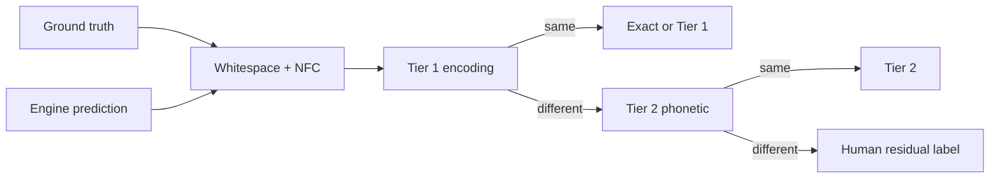

# BOOK.md

## Preface

This book is a teacher walking you through a research codebase.

It is not a changelog. `DECISIONS.md` and `IMPLEMENTATION.md` already
say what got built and why a particular library or threshold won. This
file answers a different question: **what problem exists in the world,
why is it hard, and what does building each piece of this repository
teach you about that problem?**

The test for every chapter is whether someone who has never opened this
repo — and does not already know computer vision or Indic scripts —
could read that chapter alone and come away understanding both the idea
and why this project needed it.

The chapters follow the order the work actually unfolded: first “how do
you even measure whether OCR got something right?”, then “how do you
control what a model sees?”, then “how do you open a model up and ask
whether it is reading or guessing?” Later chapters describe pieces that
are specified but not yet built in this phase; those are still taught
from first principles, so you know what they are *for* when you build
them.

A short orientation before Chapter 0:

- **Required work** in this repo is Stage 0 (error taxonomy), Stage 1
  (the controlled renderer), Stage 2a (the from-scratch instrument
  model), and the probe suite that opens that model.
- **Extensions** are the engineering that makes the science runnable on
  flaky Colab sessions: resume-by-default baselines, hand-review
  suggestions, line-crop export, `make smoke-test`.
- **Deferred research** (demo LoRA model, reading-order metrics, RLVR,
  Sarvam API transfer, triage cascade) is explained in later chapters
  so the design is not lost, but it is not claimed as finished.

Numbers that were actually recomputed from this checkout are labeled
**measured**. Numbers that appear in README or the site write-up but
whose result files are not in the tree are labeled **reported** — and
you should treat them that way until you re-run them.

> **What this book is for.** To rebuild the project with understanding,
> not to skim a list of claims.

---

## How to read this book

Start with Chapter 0 if computer vision is new to you. Otherwise start
with Chapter 1: that is where the project’s first surprising claim
lives.

Each chapter has the same shape:

1. A question that forced the chapter into existence.
2. The concept in plain language.
3. The design choice — what else was considered and why this won.
4. What got built, with real file paths.
5. What the evidence actually shows (or what is still missing).
6. One sentence to keep.

Appendices at the end are reference: decision IDs, built-vs-not,
reproduce commands. They are not the teaching path.

---

## Chapter 0 — What Is Computer Vision, and Why Is Reading Hard For a Machine

### Start with what a computer actually sees

A photograph, to you, is a scene: a page of a book, a signature, a road
sign. To a computer, it is a grid of numbers. A single-color pixel is
three numbers — how much red, how much green, how much blue, usually
each from 0 to 255. A modest photo, say 1000 pixels wide and 1000 tall,
is three million numbers. There is no “page” in there, no “letter,” no
“word.” Just a grid of brightness values.

Computer vision is the field concerned with one question: how do you get
from that grid of numbers to something that counts as understanding —
“this says Priya,” “this is a cat,” “this door is open”? Every technique
in this repo, from a ~20-million-parameter instrument model to a
production document system, is ultimately an answer to that one
question, just at different scales of ambition.

### Why “just teach it letters” doesn’t work

The oldest and most tempting approach to reading text from an image is:
find each letter, look up what it is, done. This is called
segmentation-then-classification, and for a long time it is roughly how
OCR worked. It fails for reasons that are genuinely instructive:

- **Letters touch each other.** In cursive handwriting, in many fonts,
  and structurally in scripts like Devanagari (where a connecting line
  called the *shirorekha* runs across the top of a whole word), there
  often isn’t a clean gap between one letter and the next to cut along.
- **One “letter” isn’t always one visual unit.** In Devanagari, a base
  consonant can combine with a vowel sign (a *matra*) that appears
  above, below, beside, or wrapped around it, and two or more
  consonants can stack into a single fused glyph called a *conjunct*
  (a *saṃyuktākṣara*). The visually atomic unit — the thing a reader’s
  eye treats as one character — is called a *grapheme cluster*, and it
  can correspond to two, three, or more separate values in the
  underlying digital text encoding. This mismatch between “one visual
  thing” and “one encoded thing” turns out to matter enormously for
  how you measure whether a system got the reading right — see
  Chapter 1.
- **Context changes what a shape means.** The same rough pixel pattern
  can be one letter in one font and a different letter in another; a
  smudge can look exactly like a diacritic. A system that classifies
  each cropped-out shape independently, with no knowledge of what came
  before or after it, throws away the single strongest signal a human
  reader actually uses: everything else on the page.

Modern systems, including the small one built in this repo, sidestep
segmentation almost entirely. Instead of “find each letter, then
classify it,” the approach is “look at the whole image, and generate the
text one unit at a time, using both the image and everything generated
so far as context.” That is a genuinely different kind of machine, and
it is worth understanding why it works.

### The two halves of a document-reading model

Every model in this repo, and production systems like it, has (at least)
two halves that do fundamentally different jobs.

**The encoder** looks at the image and turns it into a set of numeric
*features* — vectors that capture “what’s visually going on here,”
without yet committing to any specific letter or word. Modern encoders
for this job are usually Vision Transformers (ViTs): the image gets cut
into small square patches (say 14×14 pixels each), each patch becomes a
vector, and a mechanism called *self-attention* lets every patch’s
representation get updated based on every other patch. This is what
lets the model notice, for instance, that a mark above a letter and the
base letter below it belong together as one grapheme cluster, even
though they are in different patches.

**The decoder** takes those image features and generates text, one
grapheme cluster at a time. At each step it looks at the image features
and everything it has generated so far, and predicts what comes next.
This is the same basic mechanism that powers large language models, just
conditioned on an image instead of, or in addition to, prior text.

The connective tissue between these two halves — how image features get
translated into something the text decoder can use — is itself a design
decision with real consequences. In this project it is a simple linear
projection between two different hidden sizes (Chapter 3).

### Why this is a genuinely hard problem, not a solved one

English-language OCR on clean printed text is close to a solved problem
and has been for years. It is tempting to assume “OCR” in general is
solved and everything past that is refinement. This project exists
because that assumption is wrong for the majority of the world’s
scripts, and the reasons are specific rather than vague:

1. **Data.** The internet, and therefore the training data every large
   model learns from, is overwhelmingly English and a handful of other
   high-resource languages. A model can only get good at reading what
   it has seen enough of.
2. **Script structure.** Complex scripts genuinely require more visual
   reasoning per character than Latin text does — conjuncts, stacking
   diacritics, and connecting strokes are not just “different letters,”
   they are a different geometric problem.
3. **These two causes get tangled together in every published result.**
   When a benchmark shows a language scoring low, that low score could
   be because the model barely saw that language during training, or
   because that script is intrinsically harder to read, or some mix of
   both — and a benchmark table alone cannot tell you which. Published
   Indic OCR tables show large spreads across languages with no
   explanation of how much is which cause. (This project’s motivating
   numbers were re-checked against Sarvam’s own Vision blog in August
   2026; see `DECISIONS.md` #6.)

That untangling — how much of a language’s poor performance is “we
didn’t show the model enough of it” versus “this script is inherently
harder to read” — is not answerable by looking at outputs alone. It
requires being able to control what a model sees during training and
then measure what it learned. That requires *owning* the model, not
querying it through an API. That single sentence is the entire reason
this project builds a model from scratch rather than only ever calling
someone else’s.

### What’s coming

Every chapter after this one follows the same shape: a real problem in
computer vision, why it’s hard, and then what building a piece of this
repo taught about it. Chapter 1 starts with something that sounds
boring — how do you even *measure* whether OCR got something right? —
and shows why that question turns out to be far less obvious than it
looks, especially for scripts where “one character” and “one encoded
value” aren’t the same thing.

> **What to remember.** A machine does not see letters; it sees numbers.
> Reading systems generate text from images one visual unit at a time,
> and for Indic scripts the hardest scientific question is often not
> “how do I get a higher score,” but “what does that score even mean?”

---

## Chapter 1 — Measuring Correctness Is Its Own Hard Problem

### The question that forced this chapter

Suppose two OCR engines disagree with the ground-truth string. Are they
both wrong? Or did one of them write the *same reading* using a
different, equally valid Unicode spelling?

If you cannot answer that, every published “error rate” for Indic OCR
is partly fiction. Stage 0 of this project exists to force that answer
into the open *before* anyone trains a new model.

### What “correct” even means

Character error rate (CER) is the usual OCR metric: how many edits
(insertions, deletions, substitutions) does it take to turn the
prediction into the reference? That metric quietly assumes the
reference has one canonical digital form.

Indic orthography violates that assumption constantly. The same spoken
word, and often the same visual page, can be encoded several ways:

- Sentence-final punctuation as Devanagari danda `।`, Latin period `.`,
  or even a plain ASCII pipe `|` that some engines emit when they “see”
  a vertical stroke.
- The word *Hindi* as `हिन्दी` (explicit nasal consonant) or `हिंदी`
  (anusvara) — same pronunciation, classical sandhi, two spellings.
- Zero-width joiners and non-joiners around a virama, which change how
  a conjunct is *drawn* without changing what was *read*.
- Digits in Devanagari or Bengali script versus ASCII `0`–`9`.

Unicode already has a composition form called **NFC** that collapses
many “same character, different bytes” cases. Production eval harnesses
(including olmOCR-bench, which Sarvam’s own scoring wraps) already apply
NFC. So the interesting claim is **not** “nobody normalizes Unicode.”
It is: **NFC leaves a whole class of orthographic equivalences
untouched**, and those equivalences are real enough that counting them
as errors will make every engine look worse than it is.

This project therefore splits “not an error” into two tiers on purpose:

- **Tier 1 — encoding equivalence.** Deterministic, uncontroversial.
  Same reading, different bytes. Implemented as a hand-curated
  normalization table plus anusvara-sandhi rules in
  `src/eval/equivalence_tables.py`.
- **Tier 2 — phonetic equivalence.** A judgment call: are these two
  differently spelled strings “the same word”? Implemented by
  transliterating both into ISO 15919 Latin with aksharamukha and
  comparing there (`src/eval/transliteration_equivalence.py`). Reported
  *separately* from Tier 1, because Tier 2 can be wrong or arguable in
  ways Tier 1 cannot.

Whatever is left after those two passes is what a human should actually
look at. The residual labels this project uses are fixed:
genuine-misread, dropped-matra-nukta, reading-order-break, and
hallucinated-repeated-text. If none of those fit, the assist module is
allowed to say so rather than force a bucket.

### Why grapheme clusters, not code points

A single visual akshara can span several Unicode code points. If you
score at the code-point level, one wrong matra can look like multiple
errors, or a conjunct can be mis-attributed across pieces that were
never separate visual objects. So from Stage 0 onward, alignment and
counting happen at the **grapheme-cluster** level — the same unit the
instrument model will later treat as one vocabulary token. That choice
is Decision #7, and it is also why Chapter 0 spent time on “one visual
thing ≠ one encoded thing.”

### What we built, and why each piece exists

**1. Get real (image, text) pairs.**  
`src/data_pipeline/fetch_glotocr.py` pulls GlotOCR-bench lines for Hindi,
Bengali, Santhali, and Kashmiri into `data/raw/{language}/`, with both a
clean `*_plain.png` and a degraded `*_degraded.png` per id. Stage 0 needs
ground truth that did not come from the engines you are judging.

**2. Run existing engines without pretending they are the product.**  
`src/eval/run_baselines.py` runs Tesseract, Surya, and PaddleOCR and
writes one JSONL line per image under
`data/predictions/{engine}/{language}.jsonl`. It does not score. It only
produces the “predicted” half of the pair. It also has to survive Colab
and laptop interruptions: append+skip resume, per-image hard timeouts,
and a zip export that unpacks into the same paths the rest of the repo
expects. Those are engineering details, but they exist for a scientific
reason — a batch that silently rewrites or hangs is indistinguishable
from “we never measured this.”

**3. Explain away what is not an error.**  
Tier 0 collapses whitespace (line-wrapping noise is layout, not
reading). Tier 1 and Tier 2 then run in that order. The hand-review
viewer (`hand_review.py`) skips anything those tiers already explain,
so human attention goes to the unexplained cases. A separate assist
module (`hand_review_assist.py`) *suggests* a residual label; the human
still has to confirm, override, or skip. Auto-accepting suggestions
would turn the notes file into an agent artifact pretending to be a
hand taxonomy.

**4. Produce the Stage 0 report.**  
`src/eval/error_taxonomy.py` walks every prediction, recomputes Tier 1/2
live against current code (so fixing the equivalence table does not
require redoing the whole hand pass), and falls back to human labels
only for residuals. The deliverable is
`data/predictions/error_taxonomy.csv` plus a printed per-engine table:
what fraction of predictions are exact, Tier 1, Tier 2, genuine, or
still unreviewed.



### What the evidence shows

**Measured** from this checkout by running `python3 src/eval/error_taxonomy.py`:

On Tesseract’s 180 scored predictions, 28 were exact matches after
normalization (15.6%). Of the 152 that were *not* exact, **31 (20.4%)
were Tier 1 encoding variants** — same reading, different bytes — not
genuine misreads. Thirteen carried a human-confirmed genuine-misread
label; 108 were still UNREVIEWED because the hand pass has not covered
them yet. So the headline “about one in five apparent Tesseract errors
isn’t a real error” is real, and the report is also honestly
**incomplete** until UNREVIEWED shrinks.

Surya, on a larger set in this checkout (n=222), is exact much more
often (about 47%), and about 17% of its non-exact rows are still Tier 1.
PaddleOCR in this tree is still mostly a smoke-scale file (n=10); do not
over-read it.

Along the way the project found and fixed its own measurement bugs —
which is part of the science, not housekeeping. Whitespace-only
differences were being scored as letter substitutions until Tier 0 was
applied inside the assist heuristic. Pipe-as-danda and space-before-
punctuation cases looked like “genuine misreads” until Tier 1 grew to
cover them. Anusvara pairs were first misclassified as Tier 2 until it
became clear they are a deterministic sandhi rule and belong in Tier 1.

### What purpose this serves in everything that follows

Stage 0 is not a side quest. Every later accuracy number in this project
— instrument training curves, Probe 5 calibration, Probe 6 synthetic-
vs-real gap — is supposed to use the same notion of “correct”: grapheme-
aware, Tier-1-aware, Tier-2-aware where appropriate. If you skip Stage
0, you will later congratulate a model for “improving” when it only
learned to emit a different valid spelling.

> **What to remember.** Before you can improve Indic OCR, you have to
> stop calling valid alternate encodings “errors” — and that fraction
> is large enough to change how you read any published score.

---

## Chapter 2 — Turning Text Back Into Pixels, On Purpose

### The question that forced this chapter

Chapter 0 said the hard scientific question is exposure versus intrinsic
difficulty. To answer it, “how often did the model see this glyph?”
cannot be an accident of whatever corpus you downloaded. It has to be a
**dial you set**, while holding data volume fixed.

That is what the Stage 1 renderer is for. It is experimental apparatus,
not a convenience utility.

### Why synthesize pages when real scans exist?

Real scans are essential for honesty (this project uses them as Tier C
and for measuring degradation). But real scans will not let you say:
“show me the same amount of text, in the same layouts, with the rare
conjuncts promoted and the common ones starved.” For that you need to
start from text you already know and deliberately paint it into pixels.

So Stage 1 does three jobs that sound separate but are one system:

1. **Shape Indic text correctly** into glyphs with bounding boxes.
2. **Place that text into geometries taken from real documents.**
3. **Resample or synthesize the text** so the histogram of grapheme
   clusters matches a target mode: natural, flattened, or inverted.

### What “drawing a letter” means for Indic scripts

If you have ever drawn Latin text on a screen, the naïve algorithm is:
look up a bitmap for `A`, place it, advance the pen, look up `B`. That
is already a little wrong for Latin (kerning, ligatures), and it is
hopeless for Devanagari or Bengali.

An Indic syllable is often several Unicode code points that must be
*shaped* into one visual glyph. Hand-rolling those rules is a career.
This project calls **HarfBuzz**, the same shaping engine browsers use,
through `uharfbuzz` for glyph advances and cluster IDs, and paints with
Pillow (raqm/HarfBuzz under the hood) so the pixels and the boxes agree.
The code lives in `src/renderer/render.py`. The acceptance bar is
simple: a page should render in under a second, with exact per-cluster
ground truth.

### Layouts from the world, not from imagination

A page is not only characters. It has columns, margins, headers, tables,
form fields. Inventing a “two-column template” by hand is easy and
wrong: systems that look identical on clean synthetic pages fall apart
on real ones. So `layout_sources.py` pulls geometry from Internet Archive
scans (via IIIF page images), government PDFs, and Wikipedia Indic
articles as printable PDFs, and stores them as region boxes under
`data/cache/layouts/bank.json`.

Born-digital PDFs donate their text and table boxes directly. Camera
scans get columns inferred from ink projection profiles — an old,
deterministic trick, used here because Stage 1 must not introduce a
second neural net whose mistakes would leak into Probe 1.

The bank is still incomplete: in this checkout it has 28 templates
(mostly single-column, a couple of two-column, one marginalia) and does
not yet hold real `form` or `table-embedded` pages. That gap blocks
Stage 3’s tau-vs-complexity curve later; it does not block Probe 1’s
glyph-frequency experiment, which holds layout as fixed as possible.

### Degradation as a measured distribution

Real paper is blurry, noisy, crooked, and sometimes translucent enough
that the reverse side ghosts through. Hardcoding
`GaussianBlur(radius=1.2)` would make the “degraded” condition a
fiction. Instead, `degradation_profile.py` measures four apply-
parameters — blur sigma, noise std, skew degrees, show-through alpha —
off real scans and stores them as an empirical joint distribution.
Sampling draws a whole page’s four-tuple so blur and noise stay
correlated the way they were on paper.

**Measured** on the fitted profile in this checkout (n=22 pages): blur
median about 1.16, noise median about 1.35, skew 90th percentile about
5.6°, show-through median about 0.044. The first calibration attempt
used line-level synthetic images and reported every real book page as
“perfectly sharp” — a scale mismatch, not a scientific result. The fix
was to calibrate blur against a full Wikipedia-print page rasterized at
a matching resolution.

### The dial: natural, flattened, inverted

Probe 1 needs three training conditions with identical data *volume*
and different exposure distributions:

- **natural** — the corpus as it is.
- **flattened** — push toward uniform over observed Indic grapheme
  clusters.
- **inverted** — rare clusters inherit the mass of common ones (the
  starvation condition).

`glyph_frequency.py` is that dial. Frequency is counted only on
grapheme clusters that contain Indic script characters, so the dial
cannot waste itself promoting a stray `%` or Latin digit.

The first algorithm — reweighting whole sentences — looked right and
failed for a deep reason: every real sentence is already a natural mix
of common and rare glyphs. The set of achievable histograms is the
convex hull of sentence bags, and that hull does not reach “uniform”
or “inverted.” On the Hindi GlotOCR slice, a greedy oracle that only
picked existing sentences could not get below roughly TV 0.29 (flat) /
0.73 (inverted). So the project switched to **synthesis**: allocate an
exact integer multiset of glyphs from the target distribution, then
pack them into sentence-shaped strings with a bigram walker trained on
the source corpus. Local co-occurrence is preserved as far as the quota
allows; full linguistic naturalness is not. That naturalness confound
is why Probe 3 (blank images) exists later — to measure guessing
separately rather than ignore it.

**Measured** on the 60-line Hindi ground-truth slice with seed 0:

| mode | total variation to target | within 0.08 gate? |
|---|---|---|
| natural | 0.000 | yes |
| flattened | ≈ 0.047 | yes |
| inverted | ≈ 0.005 | yes |

That is the Stage 1 acceptance gate made concrete.

### Three realism tiers on one renderer

The same `render.py` serves three jobs:

- **Tier A** — fixed font, zero degradation, only glyph-frequency mode
  varies. Probe 1’s causal condition.
- **Tier B** — layout, font, and degradation sampled from the measured
  pools. Headroom for harder probes.
- **Tier C** — unmodified real documents with existing transcriptions.
  Reality check; no synthetic boxes.

A verification run of 100 Tier A pages under
`data/cache/renders/verify_100/` shows mean render time about 82 ms
(max about 353 ms) — well under the one-second bar.

Finally, training does not consume full pages. The instrument trains on
**line crops**. `export_line_manifest.py` and
`export_manifest_scaled.py` turn rendered pages into JSONL rows of
`{"image_path", "text"}` at a canonical 70-pixel height (five ViT
patches). Full-scale Hindi and Bengali manifests (100 pages per mode)
already sit under `data/manifests/`.

### What this stage taught

Owning the renderer is what makes “exposure versus complexity” a
question you can ask rather than a story you tell after the fact. The
surprises were mundane and useful: layout classification must ignore
tiny Wikipedia infobox tables or every article becomes
`table-embedded`; blur calibration must match pixel scale; the
frequency dial must ignore Latin punctuation; sentence resampling
cannot reach the histograms Probe 1 needs. None of those show up cleanly
in a design doc until the first real page is measured. They are in
`DECISIONS.md` so the next session does not re-learn them.

> **What to remember.** If you cannot set exposure on purpose, you
> cannot claim to have separated “rarely seen” from “hard to see.”

---

## Chapter 3 — Learning to Read From Nothing (the Instrument)

### The question that forced this chapter

Suppose you fine-tune an existing small document VLM on three different
glyph-frequency mixtures. Have you manipulated exposure?

Usually no. Those models have already seen large volumes of Indic text
during pretraining. Your fine-tuning mixture is a rounding error against
that history, and the causal claim collapses on the first serious
question. Decision #1 is therefore non-negotiable: **build a separate
instrument model from scratch**, with zero Indic pretraining exposure,
used for the diagnostic probes. A second, production-shaped model (the
demo) can come later for architecture proof. They must not be the same
weights doing double duty.

### What the instrument is trying to be

Not a competitor to Tesseract. Not a product. An instrument is a device
you can open: you can see every next-token probability, every
confidence, every behavior on a blank page. Its job is to make Probes
1–5 possible.

Concretely it is a small encoder–decoder:

- **Tokenizer** (`tokenizer.py`): vocabulary of grapheme clusters, not
  BPE. Probe 1 needs exposure measured per visual unit. BPE merges are
  frequency-driven and would tangle “how often this glyph appeared in
  the image” with “how the tokenizer happened to segment the string.”
- **Encoder** (`encoder.py`): a small Vision Transformer — patch size
  14×14, hidden size 320, six layers — trained from scratch on grayscale
  line images.
- **Decoder** (`decoder.py`): five layers, hidden size 384, causal
  self-attention plus cross-attention to encoder memory, output head
  tied to the token embedding. Autoregressive generation: given the
  image and the tokens so far, predict the next cluster.
- **Training** (`train.py`): line-level teacher forcing, fp16 (Colab T4
  has no bf16), resumable checkpoints, progress printed often enough
  that a slow run is distinguishable from a hung one.
- **Generation** (`generate.py`): greedy decode that returns not only
  text but per-step confidences and top-k candidates — the tensors the
  probes need.

**Measured** architecture size on a tiny smoke vocabulary: about 7.5M
encoder parameters and about 19.5M for the full `InstrumentModel`. With
a real Devanagari vocabulary the total grows toward the design target
of roughly 30–60M.

### Why line crops first

A full page at training resolution creates a large patch sequence and
blows memory. Lines iterate faster and match how many classical OCR
systems are trained. The renderer already knows line boxes; the export
scripts turn them into the manifest format `train.py` consumes. That
interface dependency is intentional: Stage 1 and Stage 2a meet at
`{"image_path", "text"}` JSONL, not at ad-hoc tensors.

### What is and isn’t evidenced in this checkout

The code path is real. `make smoke-test` runs tokenizer, encoder,
decoder, nine fake Probe 1 training runs, and generation end to end
with no GPU and no `data/raw` — an architecture proof that produces
**zero scientific findings by design**, and it currently passes.

Real Hindi training checkpoints and probe result JSONL files are not
necessarily present in a fresh checkout (they often live on Drive /
Colab). README and the site report early Probe 3/5 numbers from one
checkpoint; until those artifacts are re-run here, treat them as
**reported**, not as something this book independently verified.

### What purpose this serves in everything that follows

Without the instrument, Probe 2 (full output distributions) is
impossible against a closed API. Probe 3 (blank-image control) and
Probe 5 (calibration) become anecdotes. The renderer’s dial has nowhere
to plug in. The instrument is the reason Stages 1 and 0 were worth
building carefully: they feed a model you can actually interrogate.

> **What to remember.** The instrument is small and blank on purpose —
> so that “what did the model see?” and “what did it believe?” are
> questions you can answer, not stories you tell about someone else’s
> API.

---

## Chapter 4 — Teaching an Existing Model a New Trick Cheaply (the Demo)

### Why a second model exists at all

The instrument answers causal questions. A hiring manager or a
production team will also ask: “Can you build something that looks like
the systems people actually ship?”

Those systems are rarely trained from scratch on a free T4. They start
from a pretrained vision–language backbone and adapt it. The cheap,
standard way to adapt without rewriting every weight is **LoRA**: freeze
the base model, train small low-rank adapter matrices that steer its
behavior. That is the demo’s world.

The demo is also meant to mirror a production *decomposition*: not one
monolith, but separate pieces for layout detection and reading order on
top of the recognition backbone — the shape Sarvam-style digitisation
pipelines use. That is architecture demonstration, not exposure
science.

### Why this phase deferred building it

LoRA + supervised fine-tuning + later RLVR + two auxiliary modules is a
different project shape from “train a blank instrument three ways.” It
is not gated on the instrument’s findings; it is gated on time and on
T4 memory headroom. The one prerequisite that exists today is
`src/models/demo/benchmark_base_models.py`, which is supposed to measure
peak VRAM for SmolDocling-256M versus LightOnOCR-1B under LoRA before
anyone picks a base (Decision #3 is still open until that measurement
lands).

So this chapter is not a claim that the demo is finished. It is the
scientific reason the demo must stay **separate** from the instrument:
if you use a pretrained backbone for Probe 1, you are no longer
controlling exposure.

> **What to remember.** Fine-tuning a pretrained model can prove you can
> ship a shape; it cannot prove what exposure caused, because exposure
> already happened before you arrived.

---

## Chapter 5 — Where Does the Text Go on the Page

### The problem reading order actually is

Human readers do not always go top-to-bottom, left-to-right. A
two-column newspaper page is read down the left column, then down the
right. Marginalia interrupts. Tables have an internal grammar. If an OCR
system emits the right words in the wrong order, character accuracy can
look fine while the document is unusable for search, quoting, or
retrieval.

So reading order is not a classification problem (“is this block a
title?”). It is a **permutation problem**: given the set of blocks, what
sequence should they be read in?

### Why Kendall tau, not accuracy

Accuracy on order would treat “swapped two adjacent blocks” the same as
“read the page backwards.” Both are “wrong,” but they are not equally
wrong. **Kendall tau** measures how many pairwise orderings agree
between the predicted sequence and the ground-truth sequence. It gives
you a graded sense of how far off the ordering is.

This project wants that score **as a curve against layout complexity**:
single-column → two-column → marginalia → table-embedded. One average
number would hide whether the system only fails when the page gets hard.

### Tables, scoped down on purpose

An earlier idea was “table to prose”: generate a sentence per row. That
needs its own evaluation methodology (what counts as a correct
paragraph?) that this project does not have budget for. Decision #12
cuts it down to something checkable: after OCR, **is each cell still
bound to the correct column header?** The renderer can provide clean
ground truth for that. It also matches what you would compare against
Sarvam’s Extract-style structured output later.

### Why this chapter is still mostly a blueprint

The metrics files (`reading_order_metric.py`, `table_binding.py`) are
not built yet. More importantly, the layout bank still lacks the hard
categories those curves need. You can teach the concept now; you cannot
honestly report the curve until Stage 1’s bank covers real forms and
table pages.

> **What to remember.** Getting the characters right is not the same as
> getting the document right — and measuring order requires a
> permutation metric, not a yes/no.

---

## Chapter 6 — Reinforcement Learning, From Scratch

### Supervised learning versus learning from a reward

Up to the demo’s supervised fine-tuning stage, training looks like this:
the model produces a sequence, you compare it to the exact ground-truth
string, you push it toward that string. That is supervised learning.
It is powerful, and it is also limited. Some properties you care about
— “did the table structure survive?”, “did you read the blocks in the
right order?”, “did you cover the whole page?” — are awkward to express
as next-token loss.

**Reinforcement learning** flips the setup. The model acts (produces an
entire reading). Afterwards you compute a **reward** — a number that
says how good that reading was. Training pushes the model toward actions
that raise reward. When the reward can be computed automatically from
known structure (exact text, known table trees, known reading order),
people call it RL from verifiable rewards (RLVR).

### Why rewards get gamed

If your reward is “character accuracy” alone, a cunning policy can raise
the score by **saying less**: omit uncertain spans, emit only the easy
words, skip the footnote. Accuracy on what remains goes up; usefulness
goes down. That is not a hypothetical. It is the failure mode this
project plans to demonstrate on purpose.

The planned reward is therefore a sum with an explicit penalty:

> character accuracy + structure match (TEDS) + reading-order
> correlation − **coverage**

Coverage is the term that punishes omission. Decision #11 says the
*only* RLVR ablation in scope is to remove that coverage term and
quantify how much the model learns to shut up. A full sweep across every
reward component would cost more than it teaches here.

### Status in this phase

RLVR is not implemented yet; it sits behind the demo model. This chapter
exists so that when someone builds it, they inherit the scientific bar:
a verifiable reward, a known gaming mode, and one ablation that shows
the mechanism rather than a spreadsheet of tiny deltas.

> **What to remember.** A reward the model can game will be gamed —
> and omitting text is the easiest game in OCR.

---

## Chapter 7 — What Does the Model Actually Know (the Probe Suite)

### The question that forced this chapter

Accuracy answers “was the string right?” It does not answer:

- Did accuracy track how often the glyph was shown?
- When the model is wrong, what else did it almost say?
- Is it reading the pixels, or guessing from language priors?
- When it is confident, is it actually more often correct?

Those are the probes. They are the project’s real deliverable. The
instrument exists so these questions have somewhere to land.

### Probe 1 — Exposure versus complexity

Train the instrument nine times: three glyph-frequency conditions
(natural / flattened / inverted) × three random seeds. Identical data
volume. Three seeds are non-negotiable (Decision #14): with one seed,
the whole spread could be noise.

Then, for each grapheme cluster, relate accuracy to how often that
cluster appeared (log exposure), with glyph identity controlled. The
residual after accounting for exposure is a candidate estimate of
**intrinsic visual complexity** — not an unexplained leftover, but the
point of the fit.

The orchestrator is `src/probes/probe1_exposure.py`. Real nine-run
results depend on Colab training against the manifests in
`data/manifests/`. Fake-data smoke proves orchestration only.

### Probe 2 — Confusion structure

When the model misreads a cluster, do not only look at the argmax.
Look at the full next-token distribution. The runner-up mass tells you
what the model *almost* said. From that you can build a confusion graph
over glyph classes. This is nearly impossible against a closed API that
only returns text. Owning the model is what makes Probe 2 possible.
Code: `probe2_confusion_graph.py`.

### Probe 3 — Reading versus guessing

Feed the model a real line crop, a blank image of the same size, and a
noise image matched to the crop’s mean and variance. If confidence on
blank and noise stays almost as high as confidence on the real line,
the model is not grounding its certainty in vision — it is leaning on
what language “usually looks like.” That is the mechanistic account of
why low-resource scripts can fail *fluently* instead of failing loudly.

Code: `probe3_blank_control.py`. **Reported** (not re-verified in this
checkout) for one Hindi natural/seed0 run: mean confidence about 0.9929
on real lines, 0.9898 on blank, 0.9877 on matched noise — essentially
no gap. If that holds under full aggregation, it is exactly the failure
mode Probe 3 is designed to detect. It is also consistent with an
undertrained small model; more steps would be needed to separate
“hasn’t learned to use the image yet” from “this architecture never
will.”

### Probe 4 — Equivalence, again

Re-run Stage 0’s Tier 1/2 machinery on the instrument’s own outputs.
Same definition of correctness as the baselines. No new philosophy —
just consistency.

### Probe 5 — Calibration under exposure

Bucket predictions by confidence and ask whether higher buckets are
actually more accurate. A calibrated model’s 70% bucket should be right
about 70% of the time. Cross that curve with Probe 1’s exposure levels:
does calibration break specifically for glyphs that were starved in the
inverted condition? That crossing is the centerpiece question of the
project.

Code: `probe5_calibration.py`, with aggregation in
`src/analysis/aggregate_probe_results.py`. **Reported** early result
from the same checkpoint as Probe 3: nearly all mass in the 0.9–1.0
confidence bucket while accuracy there was about 0.10 — confident and
wrong. Again: treat as reported until jsonl lands in-tree.

### Probe 5b — True zero exposure (not built yet)

Santhali (Ol Chiki) and Kashmiri (Perso-Arabic) are scripts the
instrument will never have been trained on — not under-sampled, absent.
If confidence stays high there, that is the sharpest version of the
calibration failure. Optional in the current priority list; conceptually
central to the motivation in Decision #6.

### Probe 6 — Synthetic-to-real gap

Compare system behavior on Tier A/B synthetic pages versus Tier C real
pages (and a tiny handwriting anecdote, explicitly qualitative). The
question is whether the controlled world lied to you. Code exists
(`probe6_synthetic_real_gap.py`); held-out pages and predictions still
need to be produced on Colab.

### What purpose the suite serves together

One probe can be dismissed. Several probes that agree — “confidence
does not track the image,” “confidence does not track correctness,”
“starved glyphs behave differently” — become a diagnosis with an implied
fix: change the training mixture, change the decoding policy, or
refuse to trust high confidence on low-exposure scripts.

> **What to remember.** The point of owning the model is not to brag
> about accuracy; it is to ask whether the model knows when it does not
> know.

---

## Chapter 8 — Why You Can’t Learn Everything From an API

### What a closed API gives you — and what it withholds

A production OCR API typically returns text, sometimes layout, sometimes
a confidence. It does not return:

- the full next-token distribution (Probe 2),
- a blank-image control you instrument yourself under identical decoding
  (Probe 3),
- the training exposure of each glyph class (Probe 1),
- or the freedom to re-run a thousand threshold sweeps without paying
  per page.

So some questions are foreclosed entirely if you only ever call the API.
That is not a moral complaint about vendors. It is a measurement fact.

### What transfer is for in this project

The instrument’s findings are causal claims on a small model. The open
scientific question is whether those claims **rhyme** with a production
system’s error structure: do the same glyph classes that hurt the
instrument also hurt Sarvam, in roughly the same order?

Stage 5 plans a pre-specified rank-correlation test with a permutation
null — choose the statistic *before* looking at results — between
per-glyph-class error rates on the instrument and on Sarvam, on both
clean and degraded pages. Clean-only comparison is close to meaningless;
systems often cluster on clean synthetic text and spread on real
degradation (Decision #15).

### Budget is part of the science

The paid budget is about 200 pages total. Decision #19 is therefore
strict: every Sarvam page is fetched **once**, cached under
`data/cache/`, and every later sweep (including Stage 6) runs offline
against that cache. An escalation sweep that re-called the API per
threshold would burn the budget on one experiment.

This stage is not built yet (`sarvam_client.py`, `transfer_analysis.py`).
A null correlation would still be a finding: it would mean the small-
model causal story does not transfer, which is information.

> **What to remember.** An API can score a language; only a model you
> own can tell you *why* — and transfer asks whether that “why” still
> matters at production scale.

---

## Chapter 9 — Deciding When to Trust a Machine and When to Ask for Help

### Selective prediction

Sometimes the most responsible output is “I don’t know — ask a better
system / a human.” That idea is called selective prediction or
abstention. In this project’s framing, abstention means **escalation**:
send the page to a stronger (and more expensive) OCR stack.

Escalation only helps if the signal you escalate on is meaningful. A
random coin flip is an escalation policy; it is just a bad one. Probe
5’s confidence scores are the candidate signal.

### How Stage 6 would measure that

Using the Stage 5 cache only (no new paid calls), sweep every confidence
threshold and plot accuracy recovered versus fraction of pages
escalated versus cost. Compare against three baselines: random
escalation, layout-complexity escalation, and Tesseract-confidence
escalation.

The claim to defend is **router quality**: does the instrument’s
confidence identify the pages that need help better than those
baselines? The claim *not* to defend is “we saved money,” because the
instrument is not expected to beat production OCR on raw accuracy
(Decision #16). A cost-savings story built on a weak base model dies
under one follow-up question. A router-quality story survives even if
the base model is mediocre, because you are measuring the confidence
signal, not the headline CER.

### Status

`cascade.py` is not built yet. Conceptually it depends on Probe 5 being
real and on Stage 5’s cache existing. Teaching it now keeps the end of
the pipeline visible: diagnosis → transfer → action.

> **What to remember.** Confidence is only useful if it knows when to
> hand the page to someone else — and that is a measurable claim, not a
> pricing slide.

---

## Conclusion

Step back from the modules and look at what the project is arguing.

**First**, published Indic OCR numbers are hard to interpret until you
separate encoding variants from genuine misreads. Stage 0 shows that on
real Tesseract output, on the order of one in five non-exact predictions
is a Tier 1 variant, not a wrong reading — and a large unreviewed slice
means the story is still unfinished.

**Second**, “this language is hard” is not one claim. It mixes how often
glyphs were seen with how hard they are to see. Stage 1 exists to turn
exposure into a dial; the TV ≤ 0.08 gate is how you know the dial
actually moved.

**Third**, the only way to ask whether a model is reading or guessing —
and whether its confidence means anything — is to own a model you can
open. That is the instrument. The probes are the questions. The demo,
RLVR, Sarvam transfer, and cascade are how those questions eventually
meet production systems; they are deferred in this phase, not abandoned.

If you only remember three implied fixes from the whole book, remember
these:

1. Score Indic OCR with grapheme-aware, Tier-1-aware metrics.
2. Treat glyph exposure as something you design, not something you
   observe after the fact.
3. Treat fluent, high-confidence failure as a calibration and routing
   problem — not only as “need more accuracy.”

That is the scientific spine of the repository.

---

## Appendix A — Decisions index

Short map from `DECISIONS.md` into chapters. Full write-ups stay in
`DECISIONS.md`.

| ID | Topic | Chapter |
|---|---|---|
| 1 | Instrument vs demo (two models) | 0, 3, 4 |
| 2 | Grapheme-cluster vocabulary | 1, 3 |
| 3 | Demo base model TBD | 4 |
| 4 | NFC already handled upstream | 1 |
| 6 | Script scope + Sarvam number verify | 0, 7 |
| 7 | Grapheme-level alignment | 1 |
| 8 | Tier 2 via ISO 15919 | 1 |
| 9–10, 24–29 | Renderer layouts, degradation, frequency dial | 2 |
| 11 | RLVR coverage ablation only | 6 |
| 12–13 | Table binding; Sarvam Extract | 5, 8 |
| 14 | Three seeds per Probe 1 condition | 7 |
| 15–16, 19 | Transfer on Tier A+B; cascade as router; cache pages | 8, 9 |
| 18, 20–23, 26, 35 | Taxonomy / hand-review hardening | 1 |
| 31–34, 42 | Baselines resume, timeouts, Paddle API | 1 |
| 36–41, 43–45 | Instrument + line crops + Probe 6 details | 2, 3, 7 |

---

## Appendix B — Built vs described-only

**Built and used for measured claims in this book:** Stage 0 taxonomy
stack; Stage 1 renderer + manifests; Stage 2a instrument code;
`make smoke-test`; probe *code* for 1, 2, 3, 5, 6.

**Partial:** layout bank categories; degradation source mix; PaddleOCR
full corpus; Tier 2 validation set size; hand-review UNREVIEWED rows;
real probe JSONL in-tree.

**Described only (this phase):** demo LoRA stack; reading-order / table
metrics; RLVR; Sarvam client + transfer; cascade; Probe 5b.

---

## Appendix C — Language / idiom guide

| Construct | Why it appears |
|---|---|
| `regex` `\X` | Grapheme clusters; stdlib `re` cannot do this |
| NFC then NFD | Compose to compare; decompose to strip matras |
| Largest-remainder counts | Exact glyph bags for the frequency dial |
| Bigram packing | Keep some language structure under a hard quota |
| Ink projections | Layout from scans without a second neural net |
| Laplacian → blur σ | Turn a sharpness measurement into a PIL apply unit |
| Append+skip JSONL | Resume after Colab death without corrupting results |
| fp16, not bf16 | Free Colab T4 is Turing |

---

## Appendix D — Glossary

| Term | Plain meaning |
|---|---|
| Grapheme cluster / akshara | One visual syllable; may be many code points |
| Matra / nukta / virama | Vowel sign / dotted consonant mark / join killer |
| Tier 1 / Tier 2 | Encoding equivalence / phonetic equivalence |
| TV distance | How far two glyph histograms are from each other |
| Instrument | From-scratch model built to be probed |
| Demo | Pretrained+LoRA model built to look like production |
| Tier A / B / C | Clean controlled / degraded / real pages |
| Calibration | Whether confidence matches actual correctness |
| Kendall tau | How disordered a reading order is |
| RLVR | Reinforcement learning with automatically checkable rewards |

---

## Appendix E — Reproduce every headline number

From the repo root. Prefer these over memory.

```bash
# Stage 0 fractions (measured headline ~20.4% Tier 1 among Tesseract non-exact)
python3 src/eval/error_taxonomy.py

# Tier / assist self-tests
python3 src/eval/equivalence_tables.py
python3 src/eval/hand_review_assist.py
PYTHONPATH=src/eval python3 src/eval/hand_review.py --self-test

# Glyph-frequency TV gate on Hindi GT
PYTHONPATH=src python3 -c "
import json, numpy as np
from renderer.glyph_frequency import resample_corpus
texts=[json.loads(l)['text'] for l in open('data/raw/hindi/ground_truth.jsonl')]
for m in ('natural','flattened','inverted'):
    r=resample_corpus(texts,m,rng=np.random.default_rng(0))
    print(m, r.tv_distance, r.within_tolerance())
"

# Architecture smoke (no scientific findings)
make smoke-test

# Unit tests
pytest -q
```

Probe 3/5 aggregates need a checkpoint directory (often on Colab Drive):

```bash
python3 src/probes/probe3_blank_control.py --manifest data/manifests/hindi_natural.jsonl \
  --output-root <checkpoints> --condition natural --seed 0 --n-samples 30 \
  --out data/probe_results/probe3_hindi_natural_seed0.jsonl
python3 src/probes/probe5_calibration.py --manifest data/manifests/hindi_natural.jsonl \
  --output-root <checkpoints> --condition natural --seed 0 --language hindi --n-samples 30 \
  --out data/probe_results/probe5_hindi_natural_seed0.jsonl
python3 src/analysis/aggregate_probe_results.py --script hindi --out data/probe_results/summary_hindi.json
```

---

## Appendix F — Side notes

- Colab execution log: `COLAB_RUNS.md`.
- Site HTML under `site/` is a visual retelling; this file remains the
  source of truth for explanations.
- Free T4 compute shaped real choices (fp16, model size, sample caps).
  More compute would mainly buy longer training and fuller probe
  sampling so “undertrained” can be separated from “structurally
  ungrounded confidence.”

---

*When a deferred stage is built and verified, extend its chapter with
prose and evidence — do not leave the finding only in chat.*
