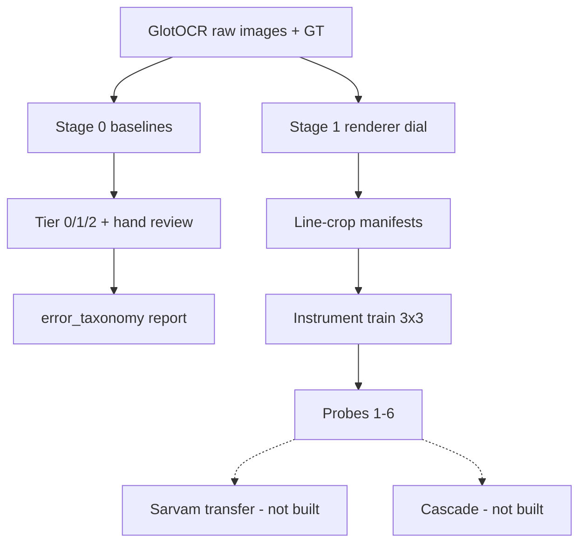
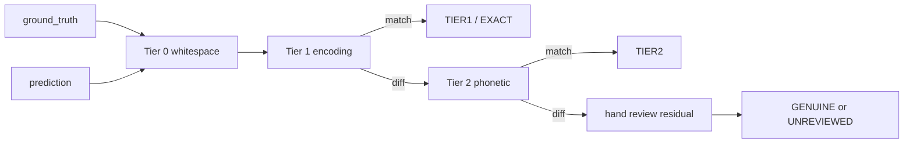

# BOOK.md — Rebuilding vlm-ocr-eval from first principles

**One line.** A diagnostic instrument for Indic document OCR: control glyph exposure, own the model’s logits and confidence, and separate “cannot see” from “confidently guessing.”

---

## Teaching contract

This is **not** a summary, **not** a README, and **not** API documentation.

It is a teaching narrative: **concept → design choice → code → evidence → takeaway**, ordered by the discovery arc of this repository. A skilled engineer who has never seen the project should be able to rebuild it from this book alone — knowing what is required, what was extended, and what is still only specified.

`IMPLEMENTATION.md` is the checkboxed spec. `DECISIONS.md` is the numbered “why.” This book is the science and the rebuild path underneath both.

---

## Layer table

| Layer | What belongs here | Paths | Chapters |
|---|---|---|---|
| **Required** | Spec’d pipeline: Stage 0 taxonomy, Stage 1 renderer dial, Stage 2a instrument, probe suite as the deliverable | `src/eval/`, `src/renderer/`, `src/models/instrument/`, `src/probes/`, `src/data_pipeline/` | 1–3, 7 |
| **Extensions** | Colab/resume tooling, hand-review assist, line-manifest export, smoke makefile, aggregation | `run_baselines.py` resume/timeout/export, `hand_review_assist.py`, `export_manifest_scaled.py`, `makefile`, `src/analysis/` | 1–2, F |
| **Research / described-only** | Demo LoRA VLM, structure metrics, RLVR, Sarvam transfer, cascade, Probe 5b | `src/models/demo/` (stub), Stage 3/5/6 modules not in tree | 4–6, 8–9, App. B |

Stages 2b, 3, 5, and 6 were deliberately not executed in this phase — see README § Future Work and Appendix B.

---

## Conventions

- **Units.** Confidence is mean per-step softmax probability in \([0,1]\). Tesseract word confidence stays native \(0\)–\(100\) until analysis. Glyph-frequency match is **total variation** \(\mathrm{TV}\in[0,1]\); Stage 1 gate is \(\mathrm{TV}\le 0.08\).
- **IDs.** Image ids are GlotOCR numeric ids; prediction keys are `(engine, language, id, variant)`.
- **Citations.** Prefer repo paths and runnable commands. Literature claims need a fetched source — never invented.
- **Measured vs reported.** Numbers run in this checkout are marked **measured**. Numbers only in README/site without checked-in artifacts are marked **reported (not re-verified here)**.
- **What to remember.** Every chapter ends with one sharp sentence in a blockquote.

---

## Table of contents

1. [Front matter (this section)](#bookmd--rebuilding-vlm-ocr-eval-from-first-principles)
2. [Requirement / product map](#requirement--product-map)
3. [Chapter 0 — What is computer vision, and why is reading hard](#chapter-0--what-is-computer-vision-and-why-is-reading-hard-for-a-machine)
4. [Chapter 1 — Measuring correctness is its own hard problem](#chapter-1--measuring-correctness-is-its-own-hard-problem)
5. [Chapter 2 — Turning text back into pixels, on purpose](#chapter-2--turning-text-back-into-pixels-on-purpose)
6. [Chapter 3 — Learning to read from nothing (the instrument)](#chapter-3--learning-to-read-from-nothing-the-instrument)
7. [Chapter 4 — Teaching an existing model a new trick cheaply](#chapter-4--teaching-an-existing-model-a-new-trick-cheaply-demo)
8. [Chapter 5 — Where does the text go on the page](#chapter-5--where-does-the-text-go-on-the-page)
9. [Chapter 6 — Reinforcement learning from scratch (RLVR)](#chapter-6--reinforcement-learning-from-scratch-rlvr)
10. [Chapter 7 — What does the model actually know (probes)](#chapter-7--what-does-the-model-actually-know-the-probe-suite)
11. [Chapter 8 — Why you can’t learn everything from an API](#chapter-8--why-you-cant-learn-everything-from-an-api)
12. [Chapter 9 — When to trust a machine and when to escalate](#chapter-9--when-to-trust-a-machine-and-when-to-escalate)
13. [Conclusion](#conclusion)
14. [Appendix A — Decisions index](#appendix-a--decisions-index)
15. [Appendix B — Built vs described-only](#appendix-b--built-vs-described-only)
16. [Appendix C — Language / idiom guide](#appendix-c--language--idiom-guide)
17. [Appendix D — Glossary](#appendix-d--glossary)
18. [Appendix E — Reproduce every headline number](#appendix-e--reproduce-every-headline-number)
19. [Appendix F — Research notes / side work](#appendix-f--research-notes--side-work)

---

## Requirement / product map

There is no external product brief in-repo. The product surface is the pipeline in `IMPLEMENTATION.md`, framed by `README.md`.

| Requirement | Module | Chapter | What was found |
|---|---|---|---|
| See real Indic OCR failure before training | `run_baselines.py`, `hand_review*.py` | 1 | Engines produce fluent wrong text; taxonomy needs human residual labels |
| Separate encoding noise from genuine misreads | `equivalence_tables.py`, `transliteration_equivalence.py`, `error_taxonomy.py` | 1 | **Measured:** ~20.4% of Tesseract non-exact Hindi/Bengali preds are Tier 1 (not real errors); Tier 2 still stub-validated; large UNREVIEWED |
| Control glyph exposure | `glyph_frequency.py`, `render.py`, `export_manifest_scaled.py` | 2 | **Measured:** Hindi GT slice TV natural=0, flat≈0.047, inv≈0.005 (≤0.08); manifests at 100 pages/mode exist |
| Own a blank-slate model | `src/models/instrument/*` | 3 | **Measured:** ~19.5M params; line-crop training API; real train/probe artifacts not in this checkout |
| Prove production-shaped architecture | Stage 2b demo | 4 | Described-only (deliberately deferred) |
| Score layout / reading order | Stage 3 metrics | 5 | Described-only; blocked on layout-bank gaps |
| Causal + calibration probes | `src/probes/*` | 7 | Code built; Probe 3/5 headline confidences **reported** in README/site, jsonl not checked in |
| Transfer to Sarvam within ~200 pages | Stage 5 | 8 | Described-only |
| Confidence-as-router | Stage 6 cascade | 9 | Described-only |



---

## Chapter 0 — What Is Computer Vision, and Why Is Reading Hard For a Machine

### Hook

Before any module in this repo makes sense, you need the problem the machine actually faces: pixels are numbers; “reading” is not looking up letters.

### Concept

A photograph is, to a computer, a grid of brightness values — typically three numbers per pixel (R, G, B) in \(0\)–\(255\). A \(1000\times1000\) color image is three million numbers. There is no letter object in that grid.

**Segmentation-then-classification** (find each letter, classify it) fails for reasons that matter here:

- Letters touch; Devanagari’s *shirorekha* connects a whole word.
- One visual unit (*akshara* / grapheme cluster) can be multiple Unicode code points (base + matras + virama + ZWJ).
- Context changes what a mark means; independent crops throw away the decoder’s strongest signal.

Modern systems, including this repo’s instrument, **look at the image and generate text one unit at a time**, conditioning on image features and prior tokens.

**Encoder** (Vision Transformer style): patch the image, self-attend across patches → visual features.  
**Decoder** (autoregressive): at each step, predict the next grapheme cluster from image features + history.

### Why Indic OCR is still hard

1. **Data.** Training corpora are skewed toward high-resource languages.  
2. **Script geometry.** Conjuncts and stacked diacritics are a harder visual problem than Latin.  
3. **Tangled causes.** A published per-language score cannot tell exposure starvation from intrinsic difficulty.

Untangling those causes requires **controlling what the model sees** — which requires owning the model, not only querying an API. That sentence is why Stage 2a exists.

### Design choice (preview of Decision #1)

Two models, not one: an **instrument** with zero Indic pretraining (causal probes), and a **demo** LoRA VLM shaped like production (architecture proof). Mixing them collapses Probe 1’s exposure claim.

### Code / evidence

No code yet — this chapter is vocabulary. The instrument’s encoder/decoder live in Chapter 3; the renderer that makes exposure controllable is Chapter 2.

> **What to remember.** OCR on pixels is sequence generation over visual units; for Indic, “one character” is often several code points, and published gaps mix exposure with difficulty.

---

## Chapter 1 — Measuring Correctness Is Its Own Hard Problem

### Hook

Stage 0 exists because “CER went down” can mean the engine got smarter — or that the scorer counted the same reading twice under two Unicode spellings.

### Concept

**Character error rate** assumes one canonical string. Indic orthography violates that:

- Danda `।` vs Latin `.` vs ASCII `|`
- Anusvara `ं` vs explicit homorganic nasal (`हिन्दी` / `हिंदी`)
- ZWJ/ZWNJ around virama; Bengali khanda-ta encodings
- Digit systems (Devanagari/Bengali vs ASCII)

**NFC** already collapses many composed/decomposed pairs (olmOCR-bench does this — Decision #4). Tier 1 is everything NFC does **not** settle. Tier 2 is the looser judgment “same sounds” via ISO 15919 transliteration (Decision #8) — reported separately because it is arguable.

Residual buckets after Tier 1/2: genuine-misread, dropped-matra-nukta, reading-order-break, hallucinated-repeated-text.

### Design choice

| Alternative | Why rejected |
|---|---|
| Code-point CER only | Mis-attributes errors inside one akshara (#7) |
| One mega-normalizer | Hides Tier 1 vs Tier 2 honesty (#8) |
| LLM as primary scorer | Non-reproducible; use LLM only to audit disagreements |
| Auto-accept assist labels | Notes would be agent artifacts (#20) |

### Code walkthrough

**Fetch GT images** — `src/data_pipeline/fetch_glotocr.py` writes `data/raw/{lang}/images/{id}_{plain|degraded}.png` + `ground_truth.jsonl`.

**Baselines** — `src/eval/run_baselines.py` runs Tesseract / Surya / PaddleOCR, appends `data/predictions/{engine}/{language}.jsonl`, skips completed keys, hard-timeouts per image (#31–#34, #42), Colab via `--data-root` / `--export-zip` (#32).

**Tier 1** — `normalize_tier1()` in `equivalence_tables.py`: NFC → whitespace collapse → anusvara sandhi → pair table (incl. pipe-as-danda, space-before-punct — #26).

**Tier 2** — `tier2_equivalent()` via aksharamukha → ISO 15919; only `hindi` / `bengali` in `SCRIPT_MAP`.

**Hand review** — `hand_review.py` skips Tier-explained diffs; `hand_review_assist.suggest_unexplained_label()` proposes a residual or no-fit; human Enter / override / `s`.

**Report** — `error_taxonomy.py` **recomputes** Tier 1/2 live (#35); human labels only for residuals.



### Evidence (**measured** this session)

```text
[tesseract]  (n=180)
  EXACT 28 (15.6%)  TIER1 31 (17.2%)  TIER2 0  GENUINE 13 (7.2%)  UNREVIEWED 108 (60.0%)
  Of 152 non-exact: 31 (20.4%) were Tier 1/2 — not real errors.

[surya]  (n=222)
  EXACT 104 (46.8%)  TIER1 20 (9.0%)  … UNREVIEWED 98 (44.1%)
  Of 118 non-exact: 20 (16.9%) Tier 1/2.

[paddleocr]  (n=10)  — smoke-scale only; mostly UNREVIEWED
```

Self-tests: Tier 1 smoke **9/9**; assist validation **13/13**; note-outcome **7/7**; `pytest` **48 passed**.

### Bugs / self-corrections

- Whitespace-only diffs inflated genuine-misread ~17% until Tier 0 in assist (#22).  
- Pipe/space-before-danda false misreads → Tier 1 expansion (#23, #26).  
- Anusvara pairs wrongly tried as Tier 2 → moved to Tier 1 sandhi (#18).

> **What to remember.** Roughly one in five Tesseract “errors” on this corpus is an encoding variant — so any Indic score without Tier 1 is quietly pessimistic.

---

## Chapter 2 — Turning Text Back Into Pixels, On Purpose

### Hook

To ask whether accuracy tracks **exposure**, exposure must be a dial you set — not a property of whatever corpus you downloaded.

### Concept

Wild scans give realism but not causal control. This stage **starts from known text** and paints pages so Probe 1 can hold volume fixed and vary glyph-cluster histograms: `natural` / `flattened` / `inverted`.

**Indic shaping** is not “blit glyph bitmaps.” HarfBuzz shapes aksharas (conjuncts, matras); this repo uses `uharfbuzz` for advances/cluster IDs (boxes) and Pillow+raqm for paint (#27).

**Layouts** come from real documents (Wikipedia PDFs, IA IIIF scans, gov PDFs) — not hand-drawn frames (#9, #21). **Degradation** is an empirical joint over blur/noise/skew/show-through (#24). **Frequency control** allocates an exact glyph multiset then packs with bigram guidance (#29) — sentence importance sampling alone cannot reach flat/inverted targets on real Indic sentences (#25→#29).

**Tiers:** A = clean, dial only; B = sampled damage; C = real docs passthrough.

### Design choice

| Alternative | Why rejected |
|---|---|
| Invented layout templates | Overstates quality on clean synth (#9) |
| Learned layout detector in Stage 1 | Errors leak into Probe 1 (#21) |
| Hardcoded blur radius | Fiction, not a distribution (#24) |
| Sentence IS alone for flat/inverted | Convex hull of sentences floors TV ≫ 0.08 (#29) |

### Code walkthrough

- `layout_sources.py` → `data/cache/layouts/bank.json`  
- `degradation_profile.py` → `data/cache/degradation/profile.json`  
- `glyph_frequency.resample_corpus()` / `synthesize_toward_target()` — `TARGET_TV_TOLERANCE = 0.08`  
- `render.render_page()` / `render_tier_a|b|c()`  
- `export_line_manifest.py` + `export_manifest_scaled.py` — page → 70px line crops + `{image_path,text}` manifests (#41, #43, #44)

### Evidence (**measured**)

| Claim | Value | Source |
|---|---|---|
| Layout bank | 28 templates: 25 single-col, 2 two-col, 1 marginalia; **no form/table-embedded** | `bank.json` |
| Degradation | n=22; blur median≈1.16, noise≈1.35, skew p90≈5.55°, show-through≈0.044 | `profile.json` |
| Glyph TV (Hindi 60-line GT, seed 0) | natural **0.000**, flattened **0.047**, inverted **0.005** | `resample_corpus` |
| Tier A verify_100 latency | n=100, mean **81.8 ms**, max **353 ms** (≪1 s) | `data/cache/renders/verify_100/` |
| Manifests | hindi natural **2538** lines; flat **2707**; inv **2872**; bengali natural **1425** | `data/manifests/` |

### Bugs / self-corrections

- Blur calibration on line-level plains → σ≈0 everywhere; fix: full-page wiki PDF at matching dpi (#24).  
- Inverted chased `%`/Latin until dial restricted to Indic clusters (#25).  
- Tiny wiki infobox tables must not force `table-embedded` (#21).

> **What to remember.** Owning the renderer is what turns “exposure vs complexity” from a story after the fact into an experiment you can run.

---

## Chapter 3 — Learning to Read From Nothing (the Instrument)

### Hook

A pretrained VLM has already seen Indic text. Fine-tuning mixture then cannot isolate exposure (Decision #1). The instrument starts blank.

### Concept

**Grapheme-cluster vocabulary** (not BPE): Probe 1 measures exposure per visual unit (#2).  
**Encoder:** patch embed (14×14) + sinusoidal positions + 6-layer TransformerEncoder, d=320.  
**Decoder:** 5-layer TransformerDecoder, d=384, causal mask, tied output head; cross-attends to projected encoder memory (#36).  
**Training:** line crops, teacher forcing, fp16 on T4 (no bf16), resumable checkpoints (#37, hard constraints).  
**Generate:** greedy decode returning text, ids, per-step confidence, top-k for probes (#38).

### Design choice

| Alternative | Why rejected |
|---|---|
| One LoRA model for probes + demo | Pretraining swamps exposure (#1) |
| BPE tokenizer | Entangles token frequency with visual exposure (#2) |
| Train on full pages first | Patch count / VRAM; lines iterate faster (#37) |

### Code walkthrough

```
src/models/instrument/
  tokenizer.py   # GraphemeTokenizer, \X via regex
  encoder.py     # InstrumentEncoder
  decoder.py     # InstrumentDecoder
  train.py       # InstrumentModel + LineDataset + train()
  generate.py    # probe-facing greedy decode
```

`train.py` expects JSONL `{"image_path","text"}` — produced by Stage 1’s export path, not raw page JSON.

### Evidence (**measured** architecture)

| Claim | Value |
|---|---|
| Encoder params | **7,460,800** |
| Decoder params (tiny vocab smoke) | ~11.9M (scales with vocab) |
| Full `InstrumentModel` (tiny vocab) | **19,468,480** |
| Design target | ~30–60M with real vocab |

Real Hindi training + Probe 3/5 numbers are **reported** in README/site (e.g. Probe 3 confidences 0.9929 / 0.9898 / 0.9877) but **checkpoint and `data/probe_results/*.jsonl` are not in this checkout** — treat as unreproduced until Appendix E commands are run against a local/Colab checkpoint root.

`make smoke-test` is the no-GPU architecture proof on fake data (#40) — produces **zero scientific findings by design**.

> **What to remember.** The instrument is deliberately small and blank so logits and confidence are observables; it is not meant to beat Tesseract.

---

## Chapter 4 — Teaching an Existing Model a New Trick Cheaply (Demo)

### Hook

The instrument isolates a variable. Production systems look different: pretrained backbone + adapters + separate layout/reading-order heads. Stage 2b is that shape — **described-only in this phase**.

### Concept

**LoRA** freezes base weights and trains low-rank adapters. The demo should look like Sarvam’s decomposition (encoder / projector / LM / layout / reading-order), not like a causal instrument.

Base choice (SmolDocling-256M vs LightOnOCR-1B) waits on T4 VRAM measurement (`src/models/demo/benchmark_base_models.py` exists as prerequisite; Decision #3 still open).

### Design choice

Deferred execution (README Future Work): multi-module SFT + RLVR is a different project shape and is not gated on instrument findings.

### Code / evidence

**Built:** `src/models/demo/benchmark_base_models.py` only.  
**Not built:** `base_model.py`, `lora_config.py`, `layout_module.py`, `reading_order_module.py`, `sft.py`, `rlvr.py`.

> **What to remember.** Demo ≠ instrument: one proves architecture; the other isolates exposure.

---

## Chapter 5 — Where Does the Text Go on the Page

### Hook

“Top-to-bottom, left-to-right” fails on two-column pages, marginalia, and tables. Reading order is a **permutation**, not a classification.

### Concept

**Kendall tau** scores how far a predicted block order is from ground truth — adjacent swaps vs full reverse are different. Stage 3 wants tau **vs layout-complexity bucket** (single-column → table-embedded), a curve not one number.

**Table binding** (scoped from table-to-prose, #12): after OCR, is each cell still bound to the correct header? Clean GT from the renderer; comparable to Sarvam Extract (#13).

### Design choice / blocker

Layout bank still lacks `form` / `table-embedded` and india.gov fetch is flaky — Stage 3 is blocked on Stage 1 PARTIAL items (`TODO.md`).

### Code / evidence

**Not built:** `src/eval/reading_order_metric.py`, `src/eval/table_binding.py`. Region `reading_order` fields already exist on layout templates for when metrics land.

> **What to remember.** Structure survival is a different question from character accuracy; measure it with permutations and bindings, not CER.

---

## Chapter 6 — Reinforcement Learning From Scratch (RLVR)

### Hook

Supervised fine-tuning teaches “imitate this string.” RL with a **verifiable reward** can optimize properties that are awkward as token-level loss — and a bad reward gets **gamed**.

### Concept

Planned reward: character accuracy + TEDS (structure) + reading-order rank correlation **− coverage** (penalize omitting text). Without coverage, accuracy rises by saying less (#11). The **only** planned ablation: remove coverage and quantify omission.

### Design choice

Full reward-component sweep rejected as expensive relative to insight (#11). Stage 2b/4 deferred this phase.

### Code / evidence

**Not built.** Spec only in `IMPLEMENTATION.md` Stage 2b / README Future Work.

> **What to remember.** If the reward doesn’t punish silence, the policy learns to shut up.

---

## Chapter 7 — What Does the Model Actually Know (the Probe Suite)

### Hook

Accuracy alone cannot tell reading from guessing, or confidence from calibration. The probes open the instrument.

### Concept

| Probe | Question | Module |
|---|---|---|
| 1 | Does accuracy track log exposure after glyph fixed effects? | `probe1_exposure.py` (9 runs; FE fit still TODO) |
| 2 | What does runner-up mass confuse with what? | `probe2_confusion_graph.py` |
| 3 | Blank/noise: is confidence from vision or LM prior? | `probe3_blank_control.py` |
| 4 | Re-run Stage 0 Tier 1/2 on instrument output | Stage 0 scorers |
| 5 | Does confidence track correctness (esp. starved glyphs)? | `probe5_calibration.py` |
| 5b | True zero-shot Santhali/Kashmiri confidence floor | **not built** |
| 6 | Synthetic Tier A/B vs real Tier C gap | `probe6_synthetic_real_gap.py` |

Probe 3 feeds real / blank / matched-noise crops and compares mean step confidence. Probe 5 buckets by confidence and checks accuracy per bucket (correctness uses Tier 1/2). Aggregation: `src/analysis/aggregate_probe_results.py`.

### Design choice

Three seeds × three conditions (#14). Fake-data smoke carries **no** exposure signal (#39, #40).

### Evidence

**Code:** probes 1–3, 5, 6 + `generate_instrument_predictions.py` + `probe_utils.py` present.  
**Reported (README / `site/Next Steps Guidance.html`, not re-verified — no `data/probe_results/` in tree):**

- Probe 3 hindi/natural/seed0: real **0.9929**, blank **0.9898**, noise **0.9877**  
- Probe 5 same checkpoint: mass in 0.9–1.0 confidence with accuracy **~0.10** in that bucket  

Read as: at this training scale the instrument is not grounding confidence in the image — expected for a small model early in training, and exactly the failure mode the suite is for.

> **What to remember.** The centerpiece is not “accuracy went up” — it is whether confidence collapses when the model is not actually reading.

---

## Chapter 8 — Why You Can’t Learn Everything From an API

### Hook

A closed OCR API returns text (sometimes confidence). It does not return full next-token distributions, blank-image behavior you can instrument, or training exposure. Probe 2’s confusion graph is impossible against a black box.

### Concept

Stage 5: spend ~200 Sarvam pages once, cache forever (#19), then offline rank-correlation between instrument per-glyph error rates and Sarvam’s — statistic pre-specified, Tier A **and** Tier B (#15). Null is still a finding.

### Code / evidence

**Not built:** `sarvam_client.py`, `transfer_analysis.py`. Budget allocation in `IMPLEMENTATION.md` Stage 5.

> **What to remember.** Transfer asks whether the causal story *rhymes* at production scale — not whether you beat the API on CER.

---

## Chapter 9 — When to Trust a Machine and When to Escalate

### Hook

Selective prediction: abstain (escalate) when confidence says “I don’t know.” Only useful if confidence is calibrated (Chapter 7).

### Concept

Stage 6 sweeps escalation thresholds **offline on the Stage 5 cache**. Report accuracy recovered vs fraction escalated vs cost. Baselines: random, layout-complexity, Tesseract-confidence. Frame as **router quality**, not cost savings (#16) — the instrument is not expected to beat Tesseract on raw accuracy.

### Code / evidence

**Not built:** `src/probes/cascade.py`.

> **What to remember.** Cascade claims die if you sell cost savings on a weak base model; router-quality claims survive.

---

## Conclusion

**Current status (honest).**

- **Built and measured here:** Stage 0 taxonomy machinery + live report; Stage 1 renderer dial (TV gate, verify renders, manifests); Stage 2a architecture (~19.5M instrument); probe *code*; unit tests green (48).  
- **Built but deferred / partial:** layout bank coverage; degradation source mix; PaddleOCR full corpus; Tier 2 validation set; hand-review UNREVIEWED gap.  
- **Described-only this phase:** demo LoRA, Stage 3 metrics, RLVR, Sarvam transfer, cascade, Probe 5b.  
- **Reported elsewhere, not in-tree:** Probe 3/5 confidence numbers after real Hindi training.

Independent lines that already converge without the deferred stages:

1. Encoding variants are a first-class fraction of “errors” (Stage 0).  
2. Exposure can be set as an experimental factor (Stage 1 TV gate).  
3. Owning decode-time confidence is what makes blank-control and calibration askable (Stage 2a + probes).

Implied fixes the project is aimed at (even before transfer): train/eval with grapheme-aware Tier 1; balance glyph exposure deliberately; treat overconfident fluent failure as a calibration bug, not only a CER bug.

---

## Appendix A — Decisions index

| ID | Title | Chapter |
|---|---|---|
| 1 | Instrument vs demo (two models) | 0, 3, 4 |
| 2 | Grapheme-cluster vocab, not BPE | 1, 3 |
| 3 | Demo base TBD (VRAM) | 4 |
| 4 | Don’t re-solve NFC (olmOCR-bench) | 1 |
| 6 | Script scope: Deva deep, Bengali structural, Santhali/Kashmiri floor | 7, F |
| 7 | Align at grapheme cluster | 1 |
| 8 | Tier 2 = ISO 15919 transliteration | 1 |
| 9 | Real layouts, not invented | 2 |
| 10 | Naturalness confound + Probe 3 | 2, 7 |
| 11 | RLVR ablation = coverage only | 6 |
| 12 | Table binding not table-to-prose | 5 |
| 13 | Compare structure to Sarvam Extract | 5, 8 |
| 14 | 3 seeds × 3 conditions | 7 |
| 15 | Transfer on Tier A and B | 8 |
| 16 | Cascade = router quality | 9 |
| 18 | Tier 2 = strict phonetic identity | 1 |
| 19 | Cache every Sarvam page once | 8 |
| 20 | Assist module separate from viewer | 1 |
| 21 | PDF text-layer vs ink projection | 2 |
| 22 | Tier 0 whitespace before assist diffs | 1 |
| 23–26 | Punctuation Tier 1 gaps closed | 1 |
| 24 | Measured degradation joint | 2 |
| 25→29 | Synthesis for frequency dial | 2 |
| 27 | uharfbuzz boxes + Pillow paint | 2 |
| 28, 42 | Surya/PaddleOCR API hardening | 1 |
| 31–34 | Resume, timeouts, process kill | 1, C |
| 35 | Taxonomy recomputes Tier 1/2 live | 1 |
| 36–38 | Instrument dims, line manifests, greedy generate | 3 |
| 39–40 | Probe 1 orchestrator; smoke-test | 7 |
| 41, 43–44 | Line GT / export / 70px height | 2, 3 |
| 45 | Probe 6 resize / held-out scoring | 7 |

(Full text: `DECISIONS.md`. #5 and #17 reserved/absent in numbering.)

---

## Appendix B — Built vs described-only

| Item | Status |
|---|---|
| `fetch_glotocr.py` | Built |
| `run_baselines.py` | Built; full Tesseract/Surya; Paddle partial |
| `equivalence_tables.py` / `transliteration_equivalence.py` / `error_taxonomy.py` | Built (Tier 2 val set incomplete) |
| `hand_review.py` / `hand_review_assist.py` | Built |
| Renderer modules + tiers A/B/C | Built (layout/degradation PARTIAL sources) |
| `export_line_manifest.py` / `export_manifest_scaled.py` | Built; full manifests present |
| Instrument tokenizer/encoder/decoder/train/generate | Built (architecture verified; real ckpts not in tree) |
| `src/probes/probe{1,2,3,5,6}*`, `probe_utils`, aggregate | Built |
| `probe5b_zeroshot_floor.py` | **Not built** |
| Demo LoRA stack | **Not built** (benchmark stub only) |
| Reading-order / table-binding metrics | **Not built** |
| RLVR | **Not built** |
| `sarvam_client.py` / transfer / cascade | **Not built** |

---

## Appendix C — Language / idiom guide

| Construct | Where | Why |
|---|---|---|
| `regex.findall(r"\X", text)` | tokenizer, glyph_frequency | Unicode grapheme clusters; stdlib `re` has no `\X` |
| `unicodedata.normalize("NFC"\|"NFD")` | Tier 1, matra strip | Compose for compare; decompose to see matras |
| Largest-remainder `target_counts_from_pmf` | glyph_frequency | Exact integer bag for TV control |
| Bigram-guided `_pack_sentence` | glyph_frequency | Preserve local co-occurrence under quota |
| Ink projection bands | layout_sources | Column geometry without a second neural net |
| Laplacian → blur σ inversion | degradation_profile | Apply-units for PIL, not raw sharpness |
| `signal.setitimer` / process kill | run_baselines | One hung image must not kill a batch |
| Append+skip jsonl | run_baselines, notes | Resume-by-default |
| `sys.path` insert to sibling package | probes → instrument/eval | Scripts not installed as a package |
| Tied `output_head.weight = token_embed.weight` | decoder | Halve vocab parameters |
| fp16 GradScaler, not bf16 | train | T4 Turing |

---

## Appendix D — Glossary

| Term | Meaning |
|---|---|
| Akshara / grapheme cluster | Visual syllable unit; often multi-codepoint |
| Matra / nukta / virama | Vowel sign / dot / vowel-killer joining conjuncts |
| Tier 0 / 1 / 2 | Whitespace; deterministic encoding; phonetic (ISO 15919) |
| TV distance | \(\frac12\sum_i \|p_i-q_i\|\) between glyph PMFs |
| Instrument / demo | Blank-slate probe model / production-shaped LoRA system |
| Tier A/B/C | Clean controlled / degraded / real passthrough pages |
| CER | Character error rate (prefer grapheme-aware alignment) |
| Kendall tau | Rank correlation for reading-order permutations |
| TEDS | Tree-edit distance similarity (table/structure) |
| RLVR | RL from verifiable rewards |
| LoRA | Low-rank adaptation of frozen weights |
| GlotOCR-bench | HF source of Stage 0 images + text |

---

## Appendix E — Reproduce every headline number

Run from repo root. Do not invent substitutes.

### Stage 0 taxonomy fractions

```bash
python3 src/eval/error_taxonomy.py
# Expect tesseract headline ~20.4% of non-exact as Tier 1/2 (n=180 preds in this checkout)
```

### Tier 1 / assist / note self-tests

```bash
python3 src/eval/equivalence_tables.py          # 9/9
python3 src/eval/hand_review_assist.py          # 13/13
PYTHONPATH=src/eval python3 src/eval/hand_review.py --self-test  # 7/7
```

### Glyph-frequency TV ≤ 0.08

```bash
PYTHONPATH=src python3 -c "
import json, numpy as np
from renderer.glyph_frequency import resample_corpus
texts=[json.loads(l)['text'] for l in open('data/raw/hindi/ground_truth.jsonl')]
for m in ('natural','flattened','inverted'):
    r=resample_corpus(texts,m,rng=np.random.default_rng(0))
    print(m, r.tv_distance, r.within_tolerance())
"
# Expect: 0.0, ~0.047, ~0.005 — all True
```

### Layout bank + degradation medians

```bash
python3 -c "
import json, numpy as np
from collections import Counter
b=json.load(open('data/cache/layouts/bank.json'))
print(len(b), Counter(x['category'] for x in b))
s=json.load(open('data/cache/degradation/profile.json'))['samples']
for a in ('blur_sigma','noise_std','skew_degrees','show_through'):
    v=np.array([x[a] for x in s]); print(a, float(np.median(v)), float(np.percentile(v,90)))
"
```

### Tier A render latency (cached verify)

```bash
python3 -c "
import json,glob,numpy as np
v=[json.load(open(f))['elapsed_ms'] for f in glob.glob('data/cache/renders/verify_100/tierA_*.json')]
print(len(v), float(np.mean(v)), float(np.max(v)))
"
# Expect n=100, mean~82ms, max<1000ms
```

### Manifest sizes

```bash
wc -l data/manifests/hindi_*.jsonl data/manifests/bengali_*.jsonl
```

### Instrument parameter count

```bash
PYTHONPATH=src/models/instrument python3 -c "
from train import InstrumentModel
from tokenizer import GraphemeTokenizer
t=GraphemeTokenizer(); t.build_vocab(['हिन्दी']*10, min_freq=1)
m=InstrumentModel(len(t))
print(sum(p.numel() for p in m.parameters()))
"
```

### Unit tests

```bash
pytest -q
# Expect 48 passed (this session)
```

### Probe 3/5 (requires checkpoint root not in tree)

```bash
python3 src/probes/probe3_blank_control.py \
  --manifest data/manifests/hindi_natural.jsonl \
  --output-root <checkpoints> --condition natural --seed 0 --n-samples 30 \
  --out data/probe_results/probe3_hindi_natural_seed0.jsonl

python3 src/probes/probe5_calibration.py \
  --manifest data/manifests/hindi_natural.jsonl \
  --output-root <checkpoints> --condition natural --seed 0 --language hindi \
  --n-samples 30 --out data/probe_results/probe5_hindi_natural_seed0.jsonl

python3 src/analysis/aggregate_probe_results.py --script hindi \
  --out data/probe_results/summary_hindi.json
```

Reported README numbers (0.9929 / 0.9898 / 0.9877) should match these jsonl aggregates once checkpoints are available.

### Architecture smoke (no findings)

```bash
make smoke-test
```

---

## Appendix F — Research notes / side work

- **Motivating spread.** README cites a large per-language OCR gap (e.g. Hindi vs Kashmiri). Before interview narrative, re-fetch current Sarvam numbers (`TODO.md` Stage 6) — original research pass is stale by design (`AGENTS.md`).  
- **GlotOCR Bench.** Fluent hallucination on unsupported scripts informs why Santhali/Kashmiri still run through baselines and why Probe 5b matters.  
- **Side artifacts.** `hand_review_notes_pre_*.bak`, `data/predictions_backup/`, `site/Next Steps Guidance.html` (visual retelling; book remains source of truth).  
- **Colab log.** `COLAB_RUNS.md` — baselines + scaled manifest export.  
- **Compute bound.** Free T4 shaped fp16, ~20M instrument, 5000-step / 30-sample probe habits — longer training would separate “undertrained” from “architecturally ungrounded confidence” (README § What more compute would buy).

---

*End of BOOK.md. When a deferred stage is built and verified, extend its chapter with measured evidence and flip Appendix B — do not leave findings only in chat.*
